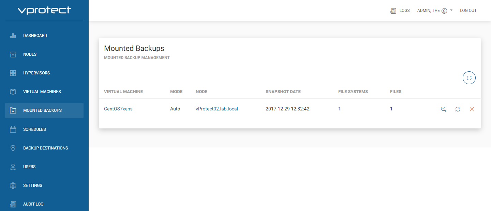

# Mounted Backups

Mounted Backups screen show mounted Virtual Machine backup's on vProtect node:

* `VIRTUAL MACHINE` - mounted virtual machine name
* `MODE` - Auto - vProtect auto detect filesystems and mount it on path "/mnt/vprotect/". In Manual mode user chose mount point for selected filesystems.
* `NODE` - vProtect node responsible for mount job.
* `SNAPSHOT DATE` - date of mounted backup of the VM.
* `FILE SYSTEMS` - number of mounted filesystems.
* `FILES` - number of mounted virtual disk images.

To remount click  button.
To end mount task click  button.
