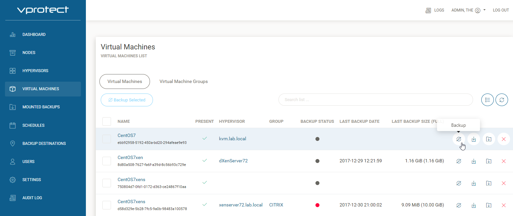
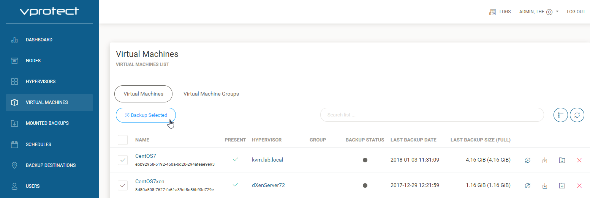

# How to backup

## Manual Backup

Open "VIRTUAL MACHINES" tab, and click on  to backup one VM.



Or select multiple VM's, and click on  to backup multiple VM's.



Next choose backup type, destination, start time, priority, and click .


On admin task console you can see backup progress.


## Scheduled Backup

Open "Policies" tab, and go to . Next create new Policy, click  .


* `Name` - virtual machines group name
* `Auto remove non-present VMs` - On - virtual machines added to virtual machines group, will be removed after delete it from vProtect.
* `Auto Assign Mode`

  ```text
    `Disabled` - vProtect don't assign VM's to group.
    `Assign only` - vProtect automaticaly assign VM's to group.
    `Assign and remove` - vProtect automaticaly assign/remove VM's to group.
  ```

* `Create Include Rule` - vProtect automaticaly assign VM's.
* `Create Exclude Rule` - vProtect automaticaly remove VM's.

  ```text
    `TAG based rule` - tag created, and assigned to VM on hypervisor.
    `Regex based rule` - common part of the name.
  ```

* `Select Backup Destination` - select one of previously created backup destination.
* `Choose VMs` - list of available VM's, what can be manually added to VM group.
* `Choose schedules` - list of created schedules, they can be assign to VM group.
* `Priority` - Priority of the task, 100 - high priority, 1 - low priority.

At the end save settings .

If you don't have created schedule, go to [schedules](admin_webui_schedules.md), and create new schedule.

