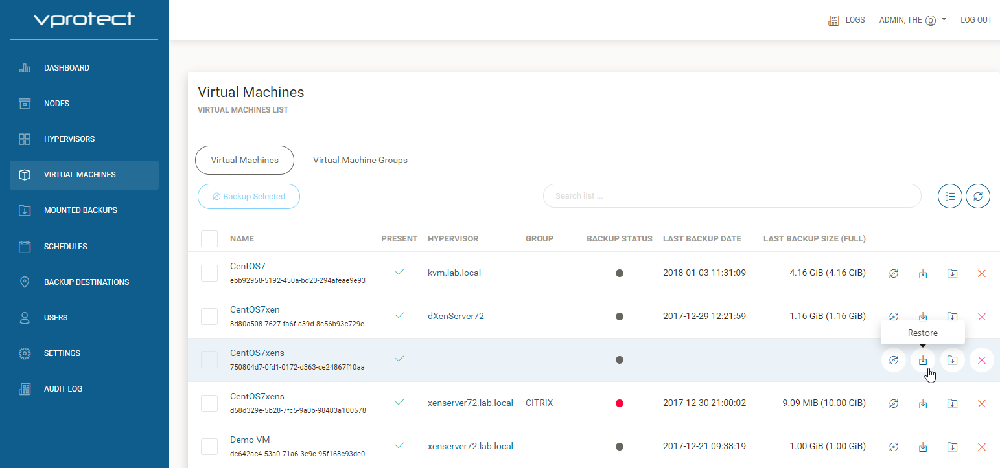
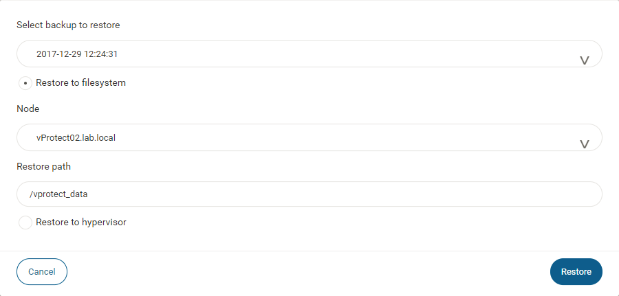

# How to restore

Open "VIRTUAL MACHINES" tab, and click on  to restore one VM.

Select date/time of the backup to restore.

a\) Restore to filesystem Select node to proceed restore job, and type correct "Restore path", default path is the same like export path. Restore to filesystem option is available to all hypervisors.

b\) Restore to hypervisor \(or hypervisor manager\). Select destination hypervisor, and ID/name of the storage, and click . Restore to hypervisor is available only for Citrix XenServer, Nutanix and RHV/oVirt \(API v4\) modes. Other platforms require native management interface to import VM image to the environment \(you just need to restore files into the export path\).

**Notice:** every platform has some restrictions imposed on the VM name, such as length or characters that can be used. Please verify check these limits before restoring with a custom name. _\*\*_

**Notice:** KVM VM disks can be imported to hypervisor on the same type of storage as they have been using during the backup. Storage for each volume needs to be passed separately:

* QCOW2-based disks require Storage ID equal to path, where QCOW2 disks should be restored, such as `/usr/lib/libvirt/images`
* LVM-based devices require VG name to be selected from the list 
* LVM Thin Provisioned volumes require thinpool to be selected from list 

