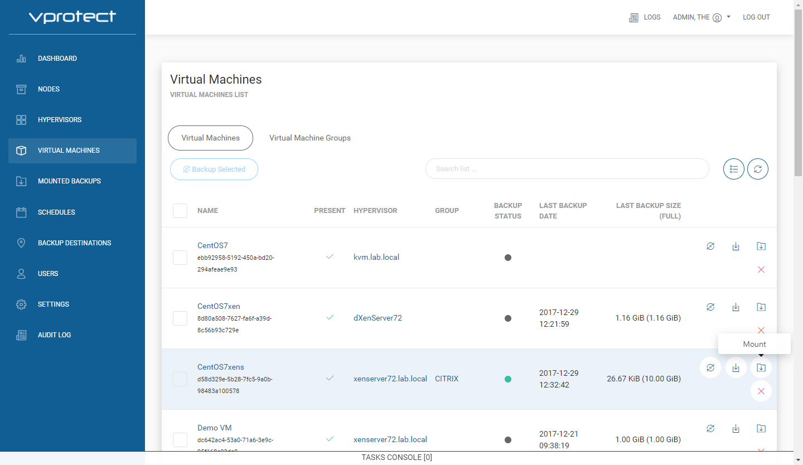
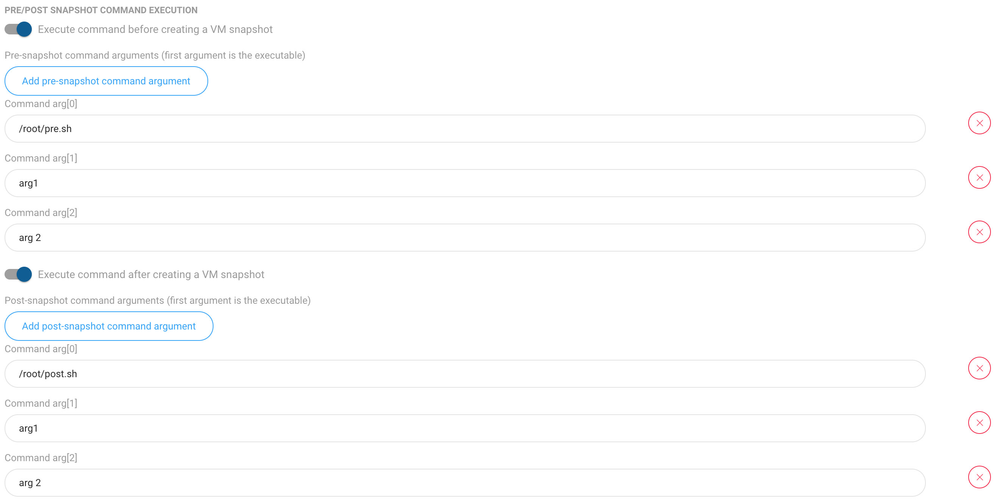
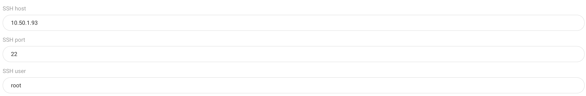
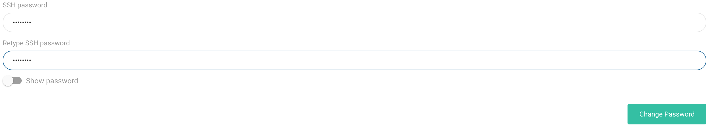

# How to setup pre/post snapshot command execution

1. Prepare your scripts
   * pre script is being invoked before snapshot is taken
   * post script is executed after snapshot is done \(or if snapshot creation fails\)
2. Upload your scripts to the VM
3. Add VM fingerprint to SSH known\_hosts on the **node**:

   * it must be `known_hosts` file that belongs to `vprotect` user
   * algorithm must be set to `ssh-rsa`
   * `VM_USER` must have sufficient privileges to execute script on the `VIRTUAL_MACHINE`

   **Example:**

   ```text
   sudo -u vprotect ssh -o HostKeyAlgorithms=ssh-rsa VM_USER@VIRTUAL_MACHINE
   ```

4. Open "VIRTUAL MACHINES" section from the left menu: 

   

5. Click VM name to open VM details page
6. Scroll down to tabs and open  tab.
7. Enable pre/post command execution and provide command arguments \(first argument is the command itself\): 

   

8. Provide SSH host/port/user information: 
9. Click  button
10. Provide SSH password and click `Change Password`: 

    

11. Initiate backup to test it the scripts have been executed correctly - in the `vprotect_daemon.log` files you should be able to see messages like this:

    ```text
    2018-05-04 14:31:26.303  INFO
    [1207e9f3-dfb5-4d19-8851-b7cf4af57543] Executing pre/post snapshot command: [/root/post.sh arg1 "arg 2"]
    ```

