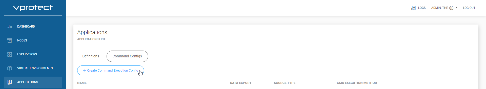

# RHV/oVirt Database backup - example

## Create Command

Open "APPLICATIONS" tab, and go to "Command Configs", then click on  to create "Command Execution Config".

Next create your command config, and click .

## Create Application

Open "APPLICATIONS" tab, and go to "Definitions", then click on  to create "Create Application Definitions".

Next create your Application, and click .

## Create Policies

Open "POLICIES" tab, and go to "Aplication backup", then click on  and chose "Aplication backup".

Next create your Policy, and click .

From that moment you can manually run backup job. From "APPLICATIONS" tab, and go to "Definitions", then click on .

## Create Scheduler

Open "SCHEDULES" tab, and go to "Aplication backup", then click on .

Next create your scheduler, and click .

