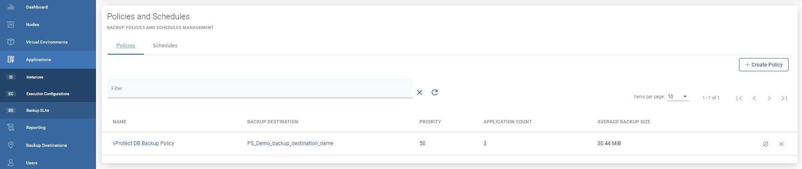
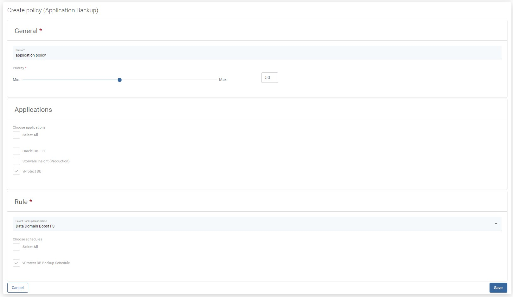
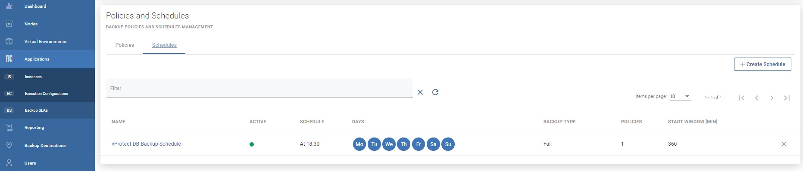
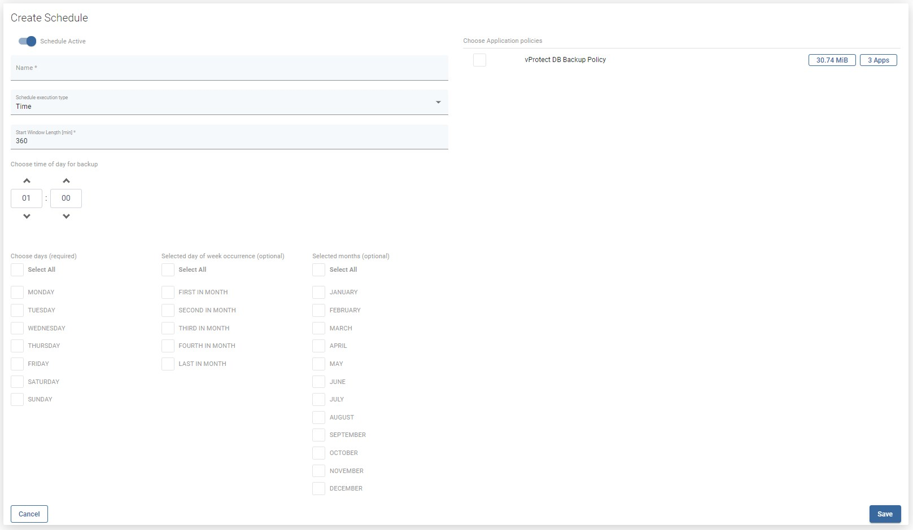

# Backup SLAs

To backup your application periodically:

* You need to create a Policy:
  * Go to Applications from the left side menu and then to Backup SLAs
  * Provide a policy name
  * Select your application from the list
  * Specify backup rule details - especially backup destination and schedules

* The second part is a schedule for policy:
  * Change tab from Policies to Schedules
  * Create a new schedule for application policy - create it just like other schedules, enter name, choose execution time \(time or interval\) and days of the week. \*optionally you can select policy if already exists

Now your application backups will be done periodically according to your policy.

