# Instances

## General

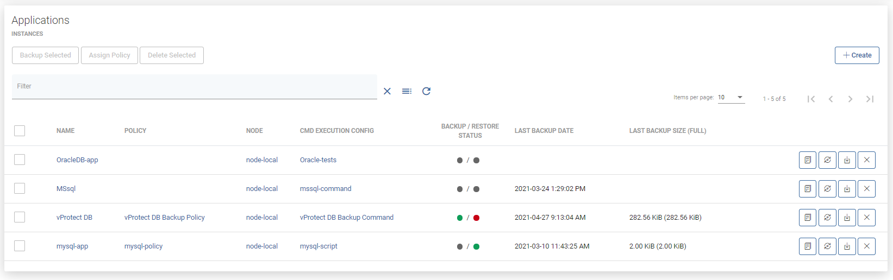

This tab allows you to create an "Application definition" and execute on-demand actions like:

* Clone  
* Backup  
* Restore  
* Delete

#### Details page

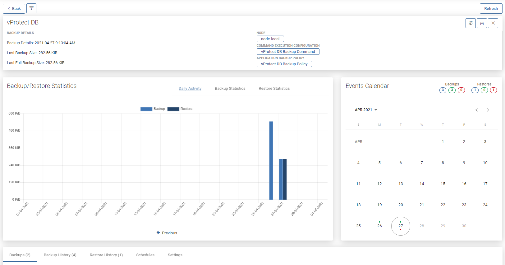

As you can see, the window has been divided into several areas like for virtual environment instances

### Application summary

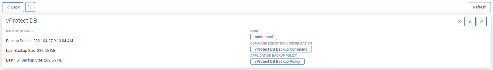

On the top, you can see summarized pieces of information about the Application, like:

* Name of application object into vProtect  
* to which command execution is assigned  
* which node is backing up this application  
* short information about the last backup actions  

You can also use several function buttons, like:

* refresh  
* back to instances list  
* backup  
* restore  
* delete

## Backup/Restore Statistics

### Daily activity

First, you'll see a daily summary of the backup and restore operations for the last month. This view is called "Daily Summary" and is the default view. You can switch a report between multiple views.

### Backup Size

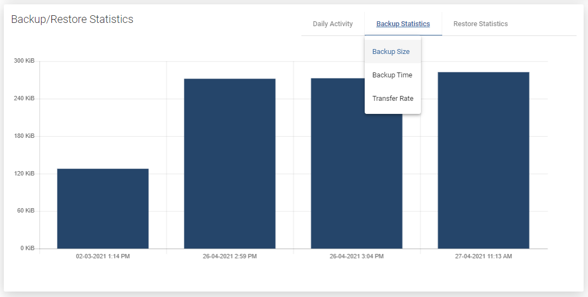

This view shows separate columns for each backup made to the application. Thanks to this, you can easily determine what data increase occurs on a given app.

### Backup Time

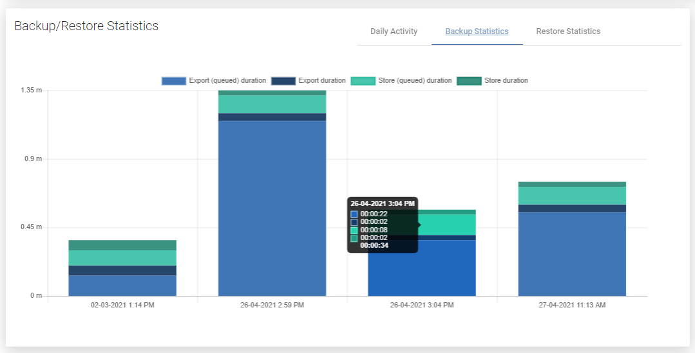

A very useful report. It allows you to determine the required window length for backups or, based on the time of individual phases, it is easy to deduce the cause of slow backups.

### Transfer Rate

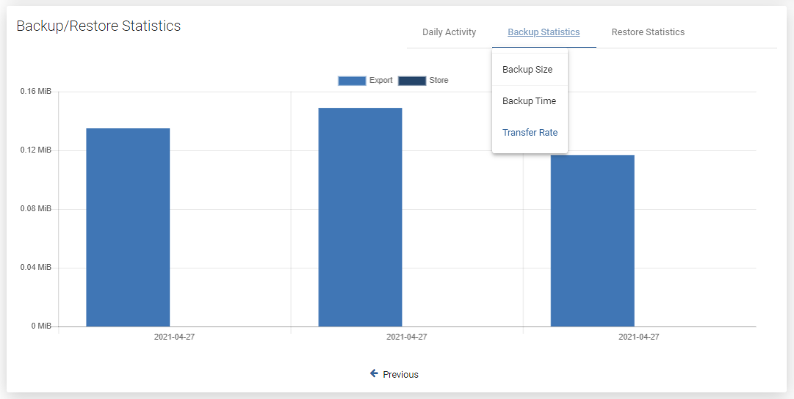

One of the latest reports, now you can easily see how fast data transfer is.

### Restore Duration

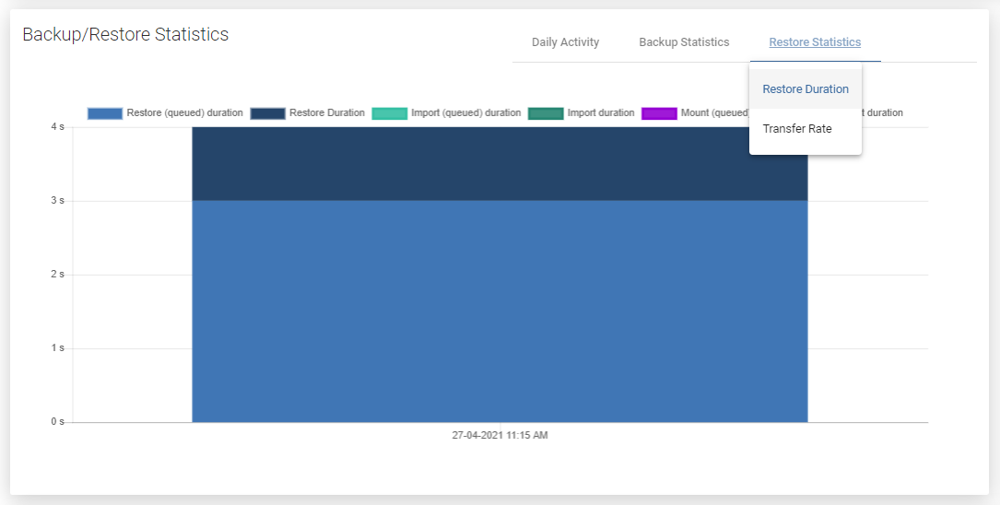

A view with the same properties as "Backup Time". It allows us to estimate how long it will take to restore the application backup files in the event of a failure.

### Restore Rate

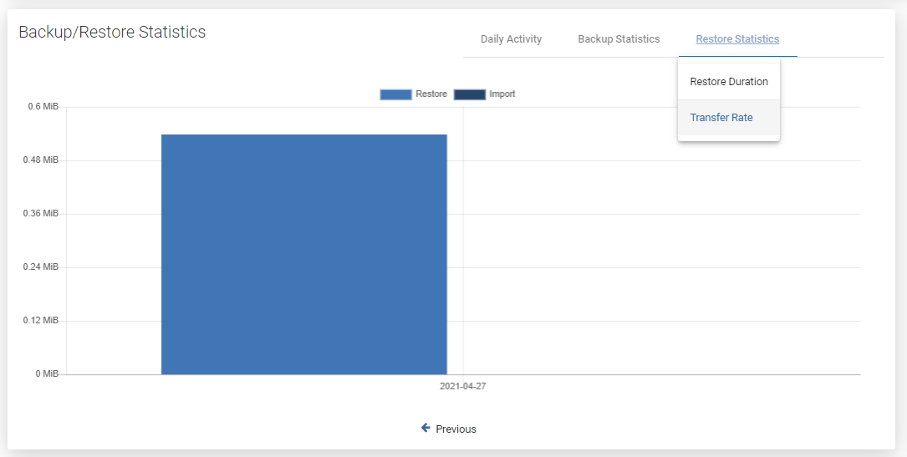

As in the previous case, we also have the transfer speed for the restore job.

## Events Calendar

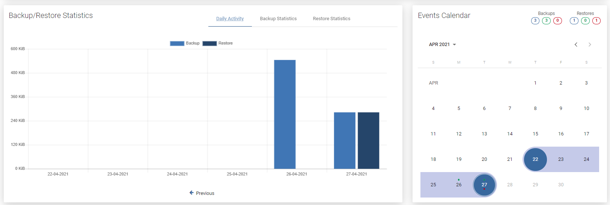

The calendar extends the possibilities of adjacent statistics. It allows you to neatly define the range of days you want to see, additionally makes a quick summary of the number of backups and restores \(top right corner\).  
**Blue** - the sum of all backups, **Green** - the sum of successes, **Red** - the sum of failures.

## Bottom menu

In the bottom menu, you can find a large number of tabs, each of which will present different information or will allow you to change the configuration of this particular application.

### Backup

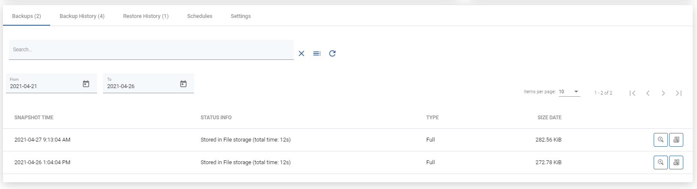

The first tab shows all application backups that are currently available and all basic information about them in a list. After pressing the magnifying glass button, you will see additional information. The button next to it allows you to download logs in the form of a .txt file.

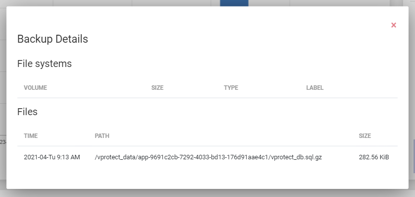

### Backup History

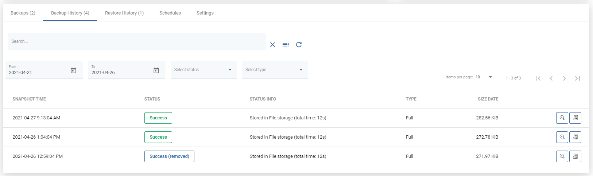

This tab shows information about all backups made for this application. Also about failed, removed \(because of retention\) or currently executing.

### Restore History

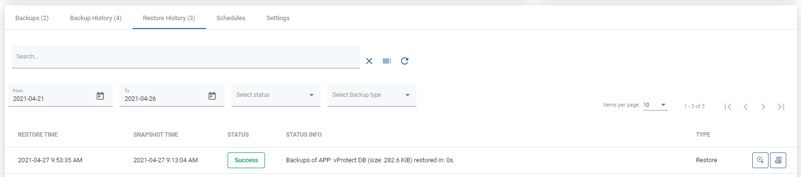

This tab is similar to "Backup History". This is a list with basic information about the application restores performed. When you open the details of the selected restore, you will see much more detailed information.

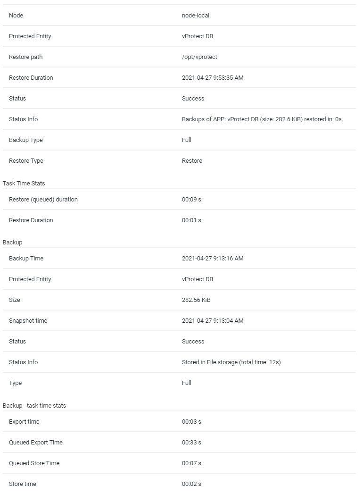

### Schedules

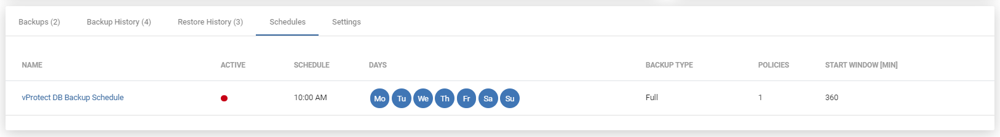

In this tab, you can see all the schedules assigned to the application.

### Settings

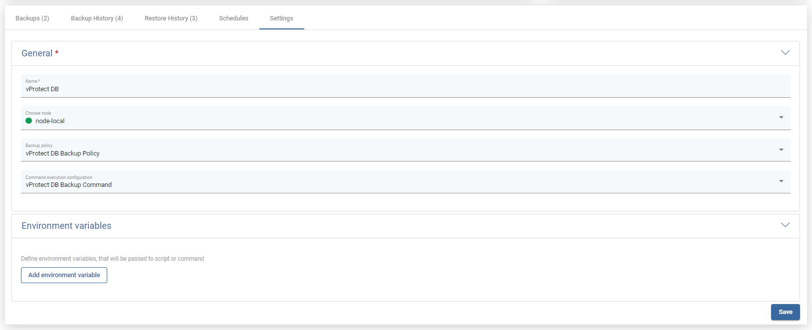

Finally, the last tab. The first two options allow you to change the node selected to perform backups and policies assigned to the application. The third alow you to choose execution configuration.

## Example - How to create an application definition

You need to provide at least its **name** and **Command Execution Configuration** and select **node** which is going to do the work - for command execution that have execution type "node".  
If the command execution type is "remote ssh" you need also to provide ssh access.  
To schedule backup of application, you need to select backup policy - more about policies and schedules you can find in this article: [Backup SLAs](backup-slas.md)

### Example - How to restore application

To perform an on-demand application restore, click the restore button on the right side of the application line.

After clicking on it, you will see a pop-up window where you can customize restore options.

If you choose the "Restore to filesystem" option, you can select things like which backup you want to restore, on which node you want to restore files, etc.

The "Restore to application" option differs in that it allows you to restore files to the server where the application is located.\*\*

\*\*This option is available for applications using "Remote SSH" in the command execution configuration

