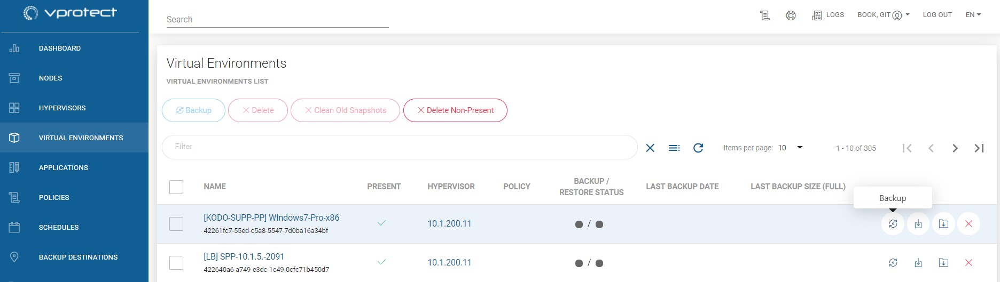
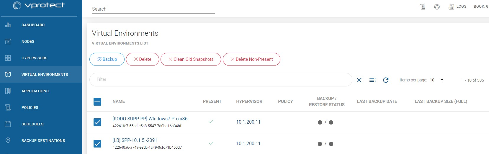
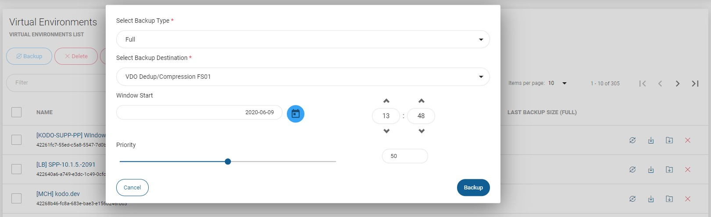
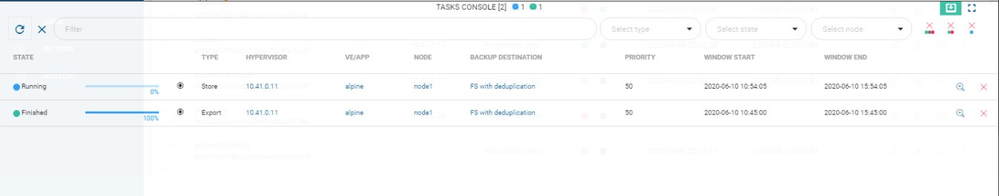
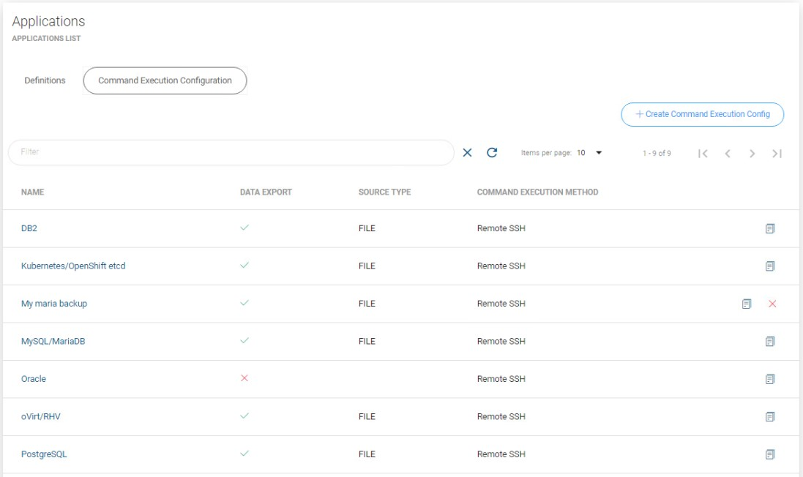
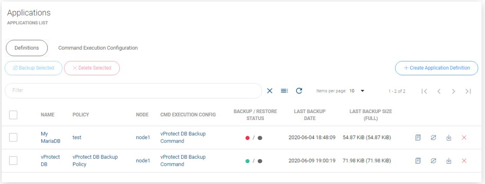

# On-Demand Backup

## Virtual Environments

To perform on-demand backup go to the Virtual Environment tab.

You can click on  icon to backup single VM

Or select multiple virtual machines and click on  icon to backup it.

Finally select backup type, backup destination, when task should start, priority and click on backup button.

On the Tasks Console, you can see the progress of the backup task.

### You can also perform the same action thanks to the CLI interface: [CLI Reference](../cli-reference.md#vm-backup-restore)

## Applications

vProtect allows you to setup periodic backup with your own scripts or application-native backup commands. These can be executed either on the Node or remotely over SSH. Application can reside anywhere - it can be a in a VM, Kubernetes deployment or on a physical box. The only requirement is to allow vProtect to execute set of commands over SSH or on the node to access data remotely.

In order to setup Application backup you need to do the following steps:

1. Prepare script or commands and \(if remote SSH execution is required\) put them on the remote machine with your application
2. In Applications section create new **Command Execution Configuration**    **** this is a description of how your script is going to be invoked - you need to specify:
   * **Command arguments** \(first one is the actual executable\) - all arguments should be provided separately - vProtect assumes that they can contain spaces
   * **CMD execution method** - either on the Node or a command to be executed remotely
   * select existing **Applications** \(or skip that for now - it can be assigned later\)
   * **Export data** - this switch allows you to export \(or not\) data that will be generated by the command \(sometimes you may wish vProtect just to execute commands without transferring anything\)
   * **Source type** \(if you export data\)
     * **FILE** - select if your command produces single file/directory \(or multiple files\) - if you provide directory or path with wildcards, vProtect will create a TAR archive - you have to specify **Source Path** for this source type
     * **STREAM** - select if your command generates backup to the standard output
   * **Timeout** - for script/command execution - make sure to have this timeout set to the value high enough to allow your command to complete its execution
3. Create Application definition     You need to provide at least its **name** and **Command Execution Configuration** and select **node** which is going to do the work
4. Optionally you can define **environment variables** that you'll later be able to use in your commands/scripts. Note, that variable name should not contain white-space characters. _\*\*_
5. At this point you should be able to manually backup your application - verify it you have successfully created a backup and stored it in your backup provider

