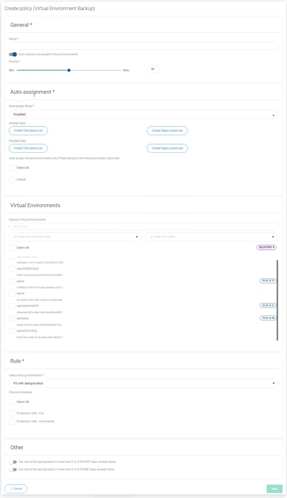

# Scheduled Backup

## Virtual Environments

To setup scheduled backups for virtual environments, you have to create policy then scheduler.

Open "POLICIES" tab and click on  button on the right.

Now you should see the policy wizard with 5 main sections.

### General

Under this section you can set up:

* Name of policy
* Switch on/off auto remove non-present virtual environments
* Set priority for tasks

### Auto-assignment

In this section you can configure automatic policy assignment based on certain criteria:

* Mode
  * Disabled
  * Assign only
  * Assign and remove
* Include or exclude rules based on hypervisor tag's or regular expression matching VM name.
* You can also select clusters to match only VMs that belong to them

### Virtual Environments

In this place, you can select virtual machines manually in a simple way.

### Rule

This section is used to select the backup destination. If you have already created a schedule, you can also select it.

### Other

It is an optional section with two switches:

* Fail rest of the backup tasks if more than xx% of EXPORT tasks already failed
* Fail rest of the backup tasks if more than xx% of STORE tasks already failed

Using the above thresholds may make sense in a situation when we can say “if X% of backup tasks failed, it means that the whole environment will fail”. Or when creating a backup of machine Y makes no sense when a backup of machine X already failed.

At the end save settings.

If you haven't created schedule, go to [Virtual Environments Schedules](../schedules/virtual-environments-schedules.md), and create new schedule.

#### You can also perform the same action thanks to the CLI interface: [CLI Reference](../cli-reference.md#vm-backup-policies) for Policies and [CLI Reference](../cli-reference.md#schedules) for Schedules

## Applications

To backup your application periodically:

1. You need to create **Schedule:**
   * In Schedules section go to the **Application backup tab** and create a new schedule 
   * optionally assign existing application backup policies if you already have them
2. Now go to **Policies** section and create a new **Application Backup policy:**
   * provide a policy **name**
   * select your applications from the list
   * specify backup rule details - especially **backup destination** and **schedules**

Now your application backups will be done periodically according to your policy.

Detailed descriptions of policy making and schedules can be found directly in the sections on these issues:  
[- Policies](../policies/application-backup.md)  
[- Schedules](../schedules/application-backup.md)

