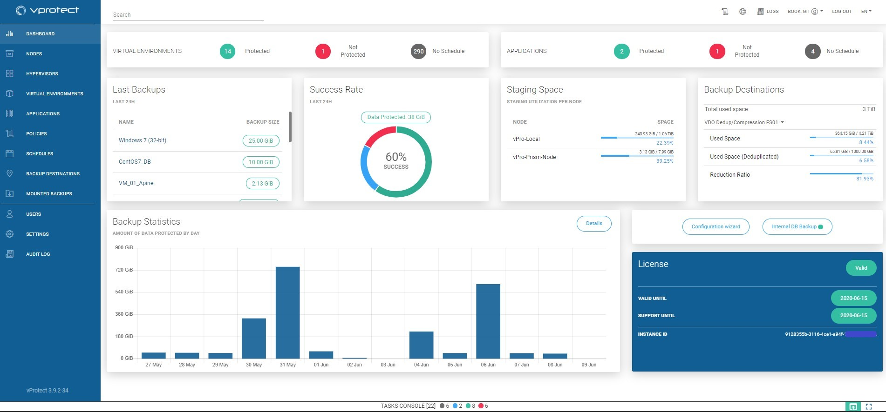

# Dashboard

## Overview

The primary vProtect interface it the WEB UI accessibly via browser.

Divided in a few sections, gives the ability to view and set most vital options related to management, monitoring and reporting.

Left pane contains the main menu \(see below for more detailed description\).

Upper right corner provides access to documentation, support and system logs.

Bottom part gives you the ability to look at the \(sliding\) task console.

Menu on the left provides access to the most important sections:

* `DASHBOARD` - main screen with general summary and configuration wizard
* `NODES` - node management and node configurations
* `HYPERVISORS` - access configuration for hypervisors and hypervisors managers, basic info about the inventoried environment like clusters and storage
* `VIRTUAL ENVIRONMENTS` - list of currently known virtual machines and access to the details page of each object
* `POLICIES` - allow you to setup a correlation between virtual machines/snapshots/recovery plans and schedules
* `SCHEDULES` - specify when and on which days tasks should be performed
* `BACKUP DESTINATIONS` - create and manage all backup destinations \(including backup retention\)
* `MOUNTED BACKUPS` - browse and download files from mounted backups
* `USERS` - create and manage your accounts \(Language, time zones etc.\)
* `SETTINGS` - From here, you can manage global settings, licenses, email, authentication and internal DB backup
* `AUDIT LOG` - watch what actions took place in the application

