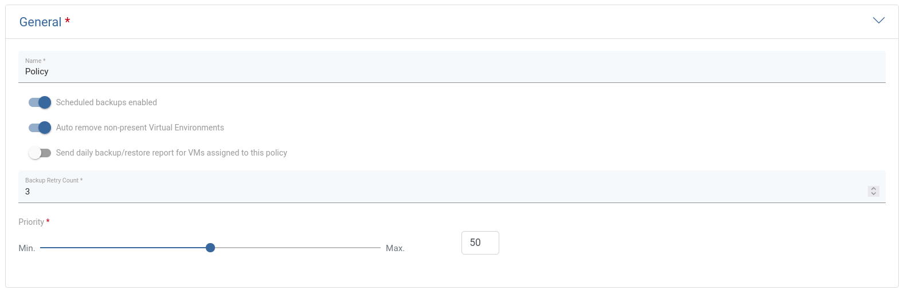
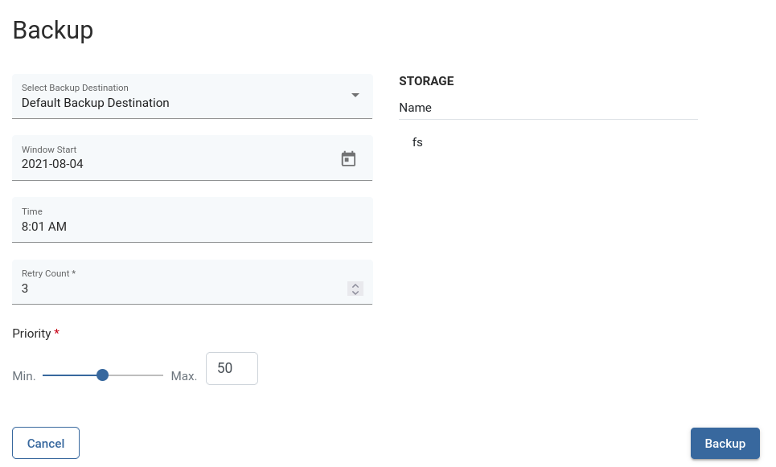
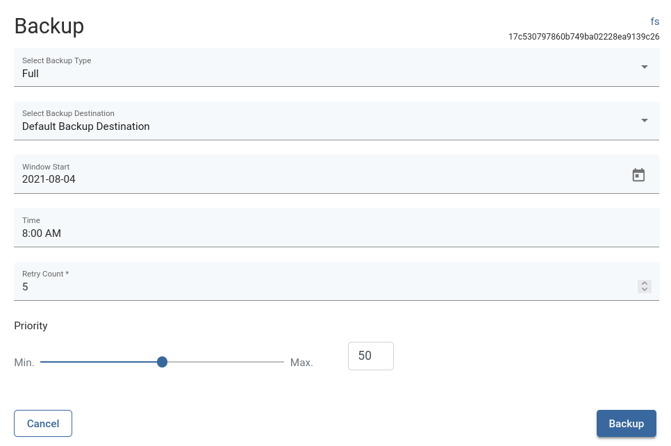

# Automatic Backup Retry

Automatic Backup Retry allows you to set the number of times a backup will be retried if the task fails.

Automatic backup is available for tasks created by the policy and tasks started manually.

## How it works

If the export task is unsuccessful and if the Backup Retry Count has been specified, a copy of the export task will be created and the Backup Retry Count for this task will be decremented.

If the export is successful but store task fails and if the Backup Retry Count has been specified, a copy of the store task will be created and the Backup Retry Count for this task will be decremented. 

When the Backup Retry Count for a task reaches 0, the task will not be retried. 