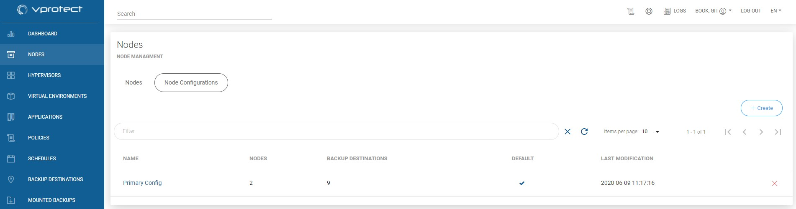
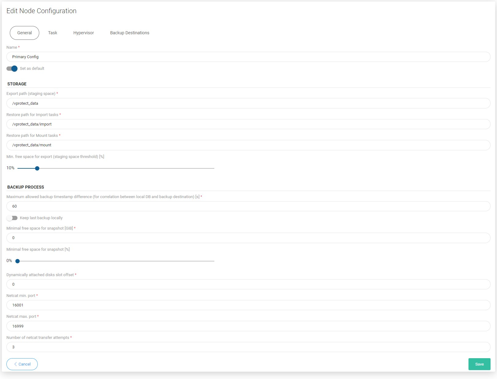
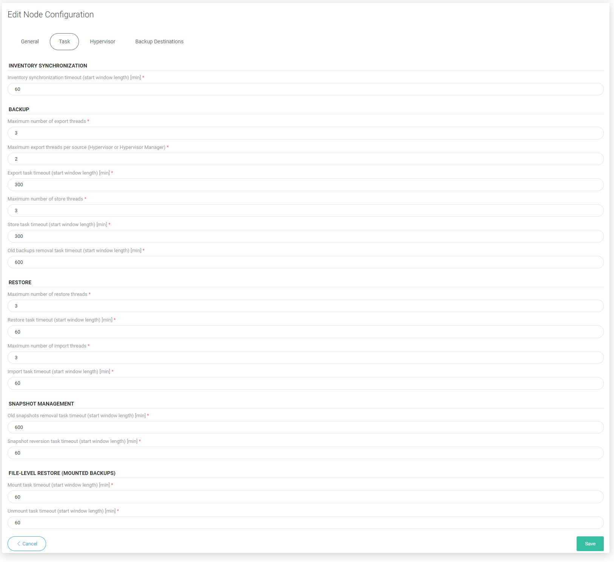
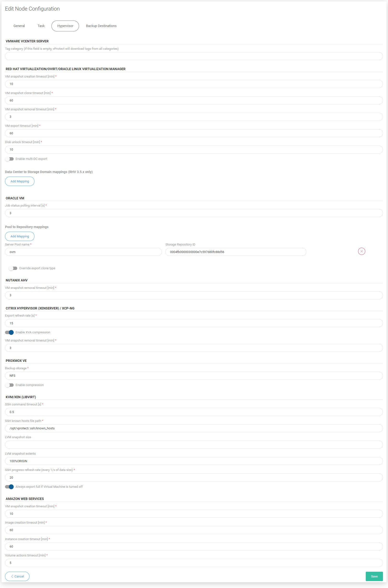
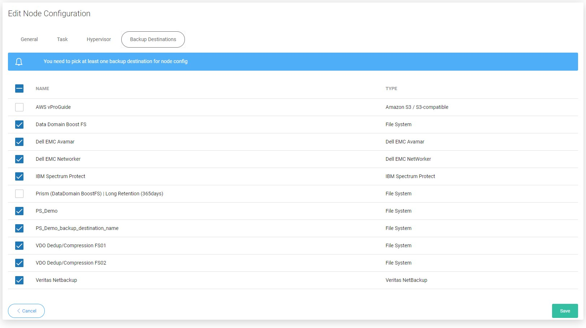

# Nodes

## Nodes Configurations

#### You can also perform the same action thanks to the CLI interface: [CLI Reference](cli-reference.md#node-configurations)

Node configurations are groups of settings assignable to set of nodes. So that you don't have to change them on every node separately.

## Available settings

### General

* `Name` - unique name identifying configuration
* `Set as default` - set default configuration to be assigned to new nodes
* `Export path (staging space)` - staging path \(must be owned by `vprotect` user\)
* `Restore path for import tasks` - in rare cases you may want to restore backups to custom location within the node before the import process begins
* `Restore path for mount tasks` - in rare cases you may want to restore backups to custom location within the node before the mount process begins
* `Min. free space for export [%]` - amount of storage space left to force node to wait with starting another export tasks
* `Max. allowed backup timestamp difference [s]`- maximum time difference between timestamp of a backup in vProtect and backup destination to match local version of backup with remote one 
* `Minimal free space for snapshot [GB]` - amount of storage space left to force node to wait with starting another tasks
* `Minimal free space for snapshot [%]` - amount of storage space left to force node to wait with starting another tasks
* `Dynamically attached disks slot offset` - this setting forces a shift of a disk slot number that node reads/writes from when disk-attachment method is used - currently used in Nutanix disk-attachment method, when you have block devices not reported by hypervisors API, such as iSCSI mounted block devices. When set to 0, vProtect will mount drives just after the last occupied \(and reported by hypervisor API\) slot \(which means that block device number 3 in API will be /dev/sdc in OS\). In general N means that vProtect will shift N slots, so 1 will make 3rd device be treated as 4th in OS /dev/sdd\)
* `Netcat min. port` - min. netcat port range
* `Netcat max. port` - max. netcat port range
* `Number of netcat transfer attempts` - maximum number of attempts 

### Task

#### **INVENTORY SYNCHRONIZATION**

* `Inventory synchronization timeout (start window length) [min]` - default length of start window for index tasks

#### **BACKUP**

* `Maximum number of export threads` - max. number of export tasks per node \(total\)
* `Maximum export threads per source (HV or HVM)` - max. number of export tasks per node \(per HV/HVM\)
* `Export task timeout (start window length) [min]` - default length of start window for export tasks
* `Maximum number of store threads` - max. number of store tasks per node
* `Store task timeout (start window length) [min]` - default length of start window for store tasks
* `Old backups removal task timeout (start window length) [min]` - default length of start window for old backups removal tasks

#### **RESTORE**

* `Maximum number of restore threads` - max. number of restore tasks per node \(total\)
* `Restore task timeout (start window length) [min]` - default length of start window for restore tasks
* `Maximum number of import threads` - max. number of import tasks per node \(total\)
* `Import task timeout (start window length) [min]` - default length of start window for import tasks

#### SNAPSHOT MANAGEMENT

* `Old snapshot removal task timeout (start window length) [min]` - default length of start window for old snapshot removal tasks
* `Snapshot reversion task timeout (start window length) [min]` - default length of start window for snapshot reversion tasks

#### FILE-LEVEL RESTORE \(MOUNTED BACKUPS\)

* `Mount task timeout (start window length) [min]` - default length of start window for mount tasks
* `Unmount task timeout (start window length) [min]` - default length of start window for unmount tasks

### Hypervisor

#### Red Hat Virtualization/oVirt/Oracle Linux Virtualization Manager

* `VM snapshot creation timeout [min]` - timeout for snapshot creation operation
* `VM snapshot clone timeout [min]` - timeout for snapshot clone operation
* `VM snapshot removal timeout [min]` - timeout for snapshot removal operation
* `VM export timeout [min]` - timeout for export operation
* `Disk unlock timeout` - timeout for disk unlock after operations \(creation, attachment, removal\)
* `Enable multi-DC export` - enables export to separate subdirectories for each DC
* `Data Center to Storage Domain mappings (RHV 3.5.x only)` - \(optional\) this is for manual definition of mapping between Export Storage Domains and Data Centers

#### Oracle VM

* `Job status polling interval [s]` - defines how often progress of a job submitted to OVM manager must be checked
* `Pool to Repository mappings` - defines which `Storage Repository ID` must be used to to export backups for `Server Pool` 
* `Override export clone type` - 

#### Nutanix AHV

* `VM snapshot removal timeout` - timeout for snapshot removal operation

#### Citrix Hypervisor \(XenServer\) / XCP-NG

* `Export refresh rate [s]` - defines how often progress of a job submitted to Citrix Xen Server must be checked
* `Enable XVA compression` - enables compression for XVA \(full backups\)
* `VM snapshot removal timeout` - timeout for snapshot removal operation

#### Proxmox

* `Backup storage` - name of the storage used to export backups
* `Enable compression` - specifies if backups should be exported in compressed format - if enabled, you can choose between GZIP and LZO formats

#### KVM/Xen \(libvirt\)

* `SSH command timeout [s]` - timeout for SSH command that is invoked
* `SSH known hosts file path` - path to the `known_hosts` file \(accessible for `vprotect` user\)
* `LVM snapshot size` - value for “-l” parameter in `lvcreate` command
* `LVM snapshot extents` – value for “-L” parameter in `lvcreate` command
* `SSH progress refresh rate (every 1/x of data size)` - how often to refresh progress when transferring data over SSH \(x times per data size\)
* `Always export full if virtual machine is turned off` - 

#### Amazon Web Services

* `VM snapshot creation timeout [min]` - timeout for snapshot creation operation
* `Image creation timeout [min]` - timeout for image creation operation
* `Instance creation timeout [min]` - timeout for instance creation operation 
* `Volume actions timeout [min]` - timeout for volume operations

### Backup destinations

This section is used to add/remove backup destinations to the nodes using this configuration. Only backup destinations enabled here can be used by the nodes.

