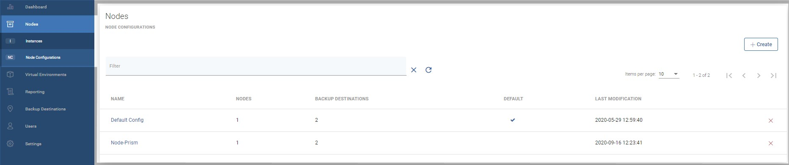
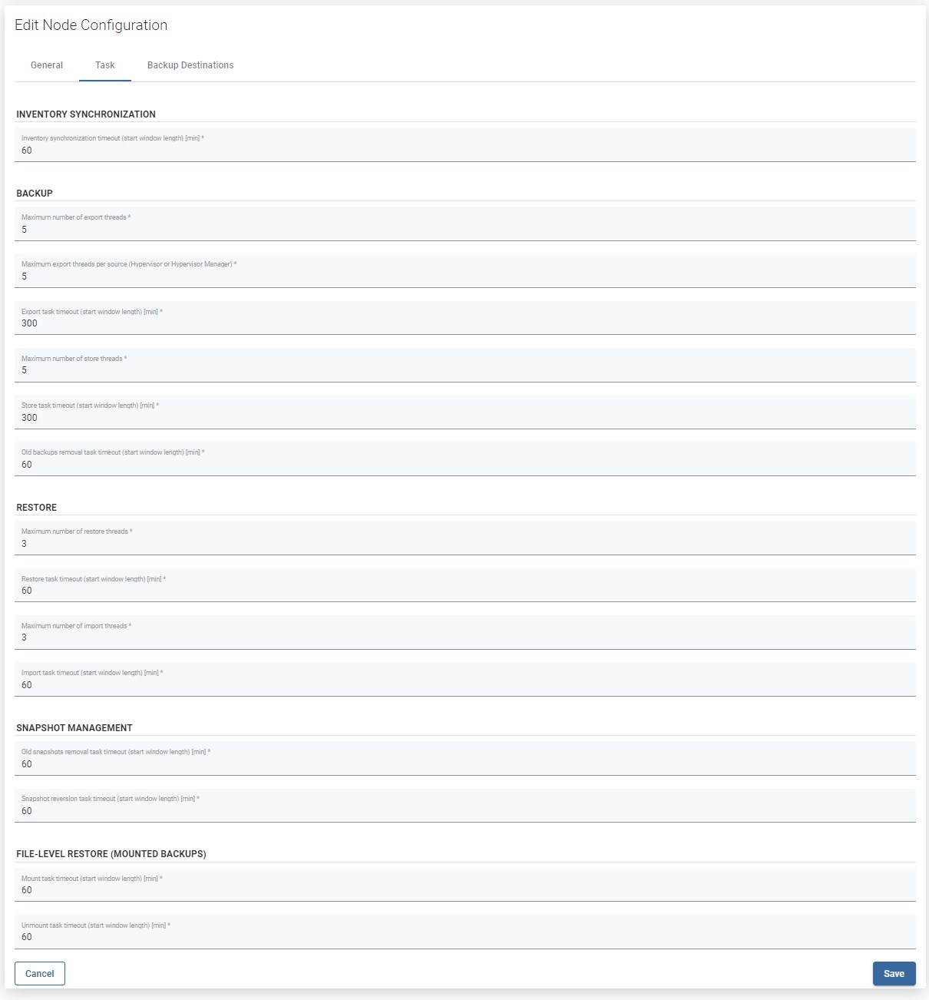

# Nodes

## Nodes Instances

Node instances are a list of the vProtect nodes that currently exist in your environment. You can easily check basic information about the nodes or change the assigned node configuration.

## Node Configurations

#### You can also perform the same action using the CLI interface: [CLI Reference](cli-reference.md#node-configurations)

Node configurations are groups of settings assignable to a set of nodes. This is so that you don't have to change them on every node separately.

**Note:**

* Node Configurations from previous versions \(4.2 and lower\) have been migrated to new node configurations in a way that every node will have their own corresponding node configuration. The old configurations have been preserved in the system.
* The task-to-node assignment will be executed via task's hypervisor/hypervisor manager/storage provider relation to the node configuration where the system will decide on the specific node assigned to the aforementioned configuration responsible for executing the task.

## Available settings

### General

* `Name` - unique name identifying the configuration
* `Set as default` - set default configuration to be assigned to new nodes

**Storage**

* `Export path (staging space)` - staging path \(must be owned by the `vprotect` user\)
* `Restore path for import tasks` - in rare cases, you may want to restore backups to a custom location within the node before the import process begins
* `Restore path for mount tasks` - in rare cases, you may want to restore backups to a custom location within the node before the mounting process begins
* `Min. free space for export [%]` - amount of storage space left in order to force a node to wait before starting another export task

**Backup Process**

* `Max. allowed backup timestamp difference [s]`- maximum time difference between the timestamp of a backup in vProtect and the backup destination in order to match the local version of the backup with the remote one 
* `Minimal free space for snapshot [GB]` - amount of storage space left in order to force a node to wait before starting another task
* `Minimal free space for snapshot [%]` - amount of storage space left in order to force a node to wait before starting another task
* `Dynamically attached disks slot offset` - this setting forces a shift of a disk slot number that the node reads/writes from when the disk-attachment method is used - currently used in the Nutanix disk-attachment method when you have block devices not reported by the hypervisor API, such as iSCSI mounted block devices. When set to 0, vProtect will mount drives just after the last occupied \(and reported by the hypervisor API\) slot \(which means that block device number 3 in API will be /dev/sdc in OS\). In general, N means that vProtect will shift N slots, so 1 will make the 3rd device be treated as the 4th in OS /dev/sdd\)
* `Netcat min. port` - min. Netcat port range
* `Netcat max. port` - max. Netcat port range
* `Number of netcat transfer attempts` - maximum number of attempts
* `BZIP2 Compression` - compress backup files with bzip2

### Task

**INVENTORY SYNCHRONIZATION**

* `Inventory synchronization timeout (start window length) [min]` - default length of the start window for index tasks

**BACKUP**

* `Maximum number of export threads` - max. number of export tasks per node \(total\)
* `Maximum export threads per source (HV or HVM)` - max. number of export tasks per node and per HV/HVM
* `Export task timeout (start window length) [min]` - default length of the start window for export tasks
* `Maximum number of store threads` - max. number of store tasks per node
* `Store task timeout (start window length) [min]` - default length of the start window for store tasks
* `Old backups removal task timeout (start window length) [min]` - default length of start window for old backup removal tasks

**RESTORE**

* `Maximum number of restore threads` - max. number of restore tasks per node \(total\)
* `Restore task timeout (start window length) [min]` - default length of start window for restore tasks
* `Maximum number of import threads` - max. number of import tasks per node \(total\)
* `Import task timeout (start window length) [min]` - default length of the start window for import tasks

**SNAPSHOT MANAGEMENT**

* `Old snapshot removal task timeout (start window length) [min]` - default length of start window for old snapshot removal tasks
* `Snapshot reversion task timeout (start window length) [min]` - default length of start window for snapshot reversion tasks

**FILE-LEVEL RESTORE \(MOUNTED BACKUPS\)**

* `Mount task timeout (start window length) [min]` - default length of start window for mount tasks
* `Unmount task timeout (start window length) [min]` - default length of the start window for unmount tasks

### Backup destinations

This section is used to add/remove backup destinations to the nodes using this configuration. Only backup destinations enabled here can be used by the nodes.

