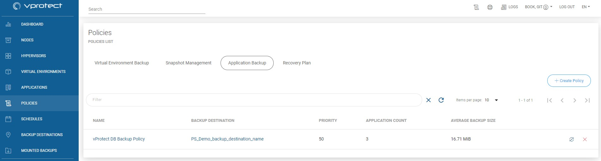
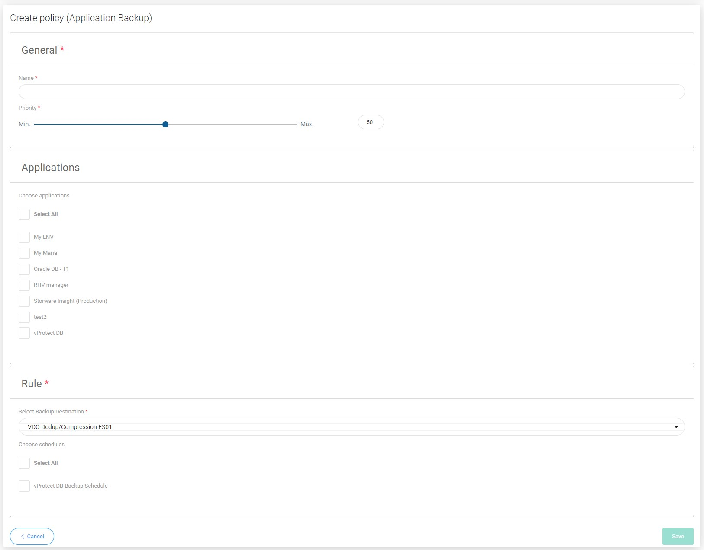

# Application Backup

In the case of application policies, they are only needed to set the schedule. They also allow you to run a backup on demand, but they are not required for this, because you can also do it from the applications tab.

You will also notice much less configuration options in the wizard window.

## General

Under this section you can set up:

* Name of policy
* Set priority for tasks

## Applications

In this place, you can select your definitions of applications. We describe this topic further in the on-demand backups section [On-Demand Backup](../backup/on-demand-backup.md#applications)

## Rule

This section is used to select the backup destination. If you have already created a schedule, you can also select it.

### You can also perform the same action thanks to the CLI interface: [CLI Reference](../cli-reference.md#application-backup-policies)

