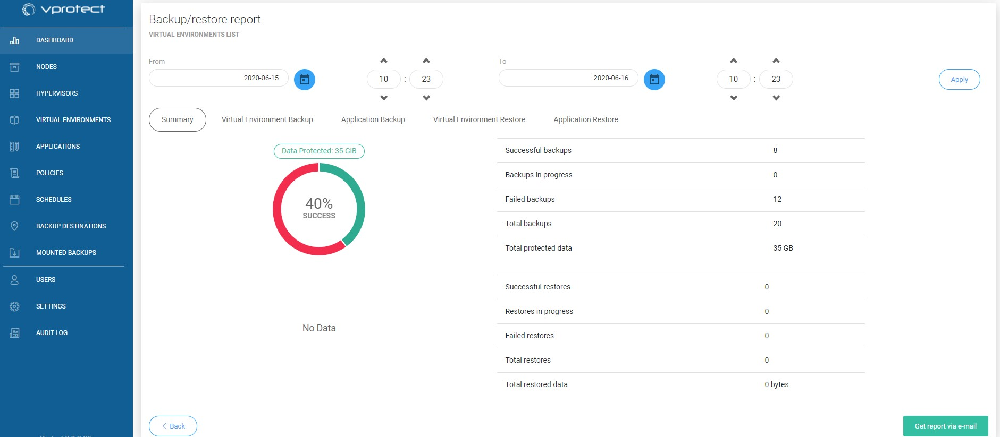
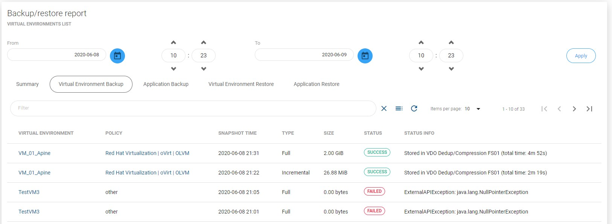

# Reporting

## Main Dashboard

We also created for our users some reporting features. You can reach to them from main dashboard under section "Backup Statistics" through  button

At the beginning you should see the summary page.:

From here, you can set a date range or go to a detailed summary of each of the four categories.

Or you can also send this report by email thanks to this button 

