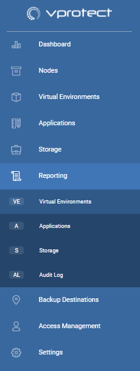
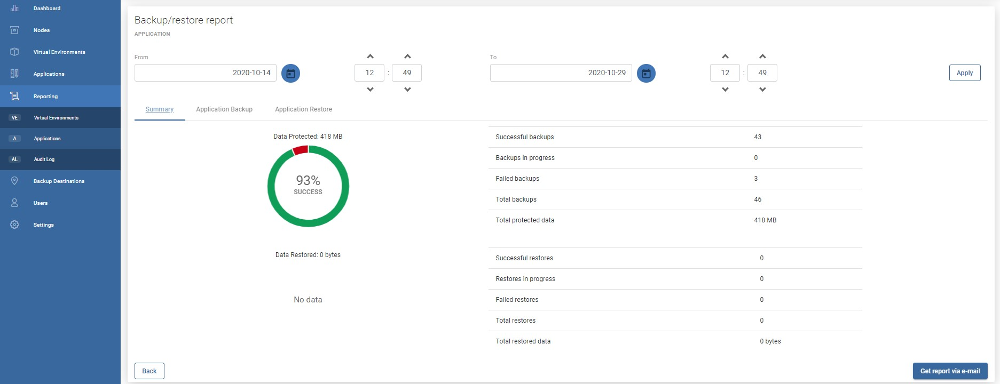
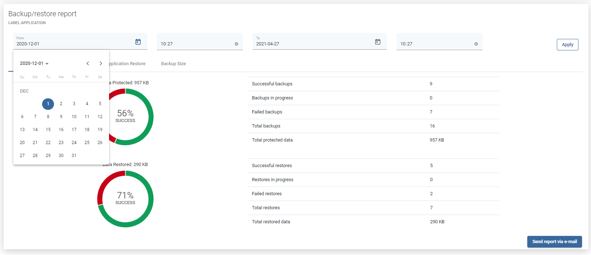
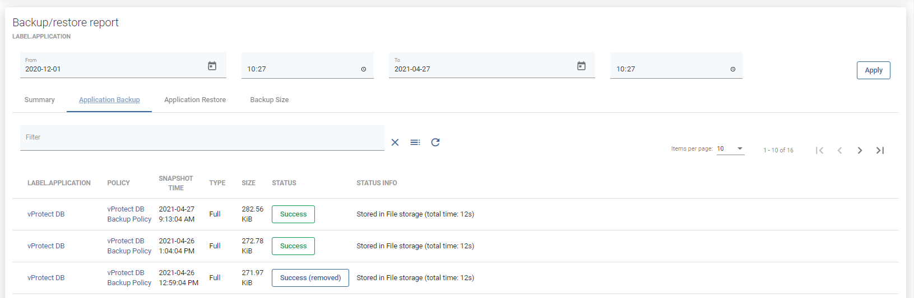
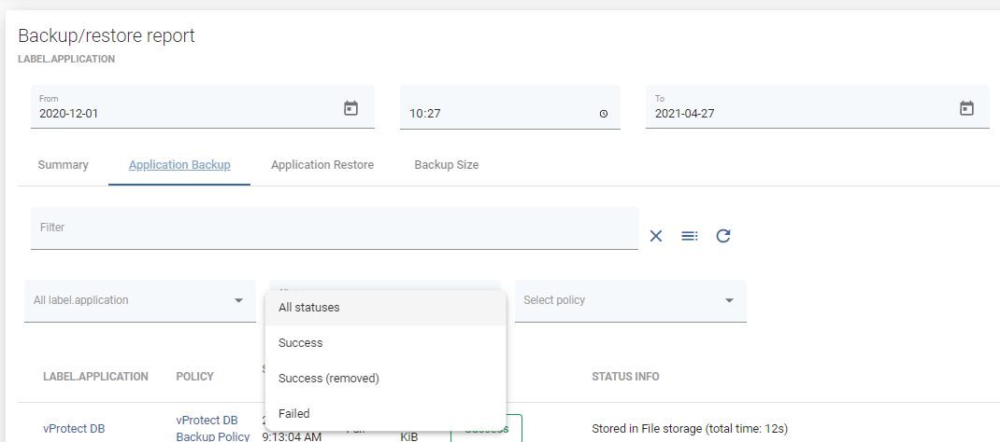
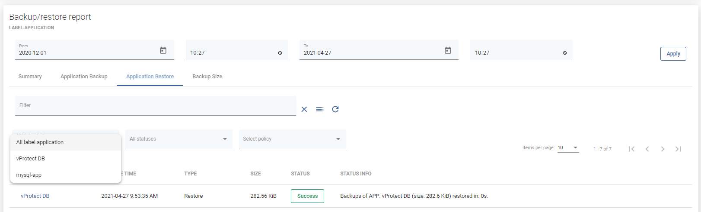
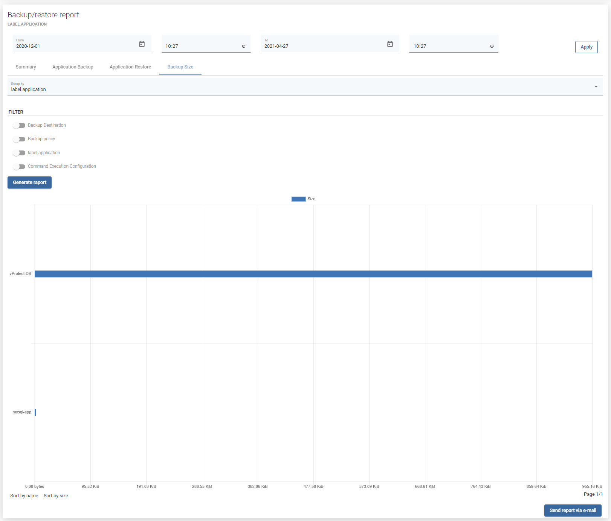
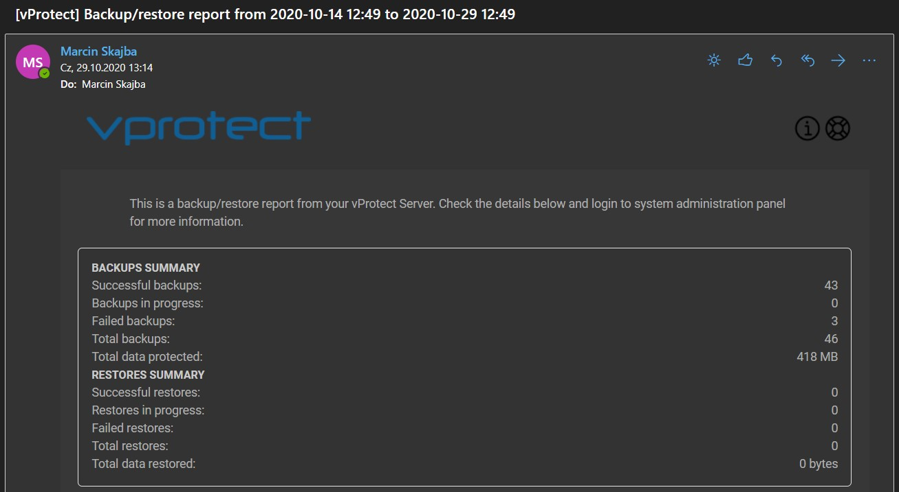

# Applications

## General

vProtect provides reporting functionality to obtain information on historical activity.  
You can reach them from the main dashboard in the "Activity" section with the button -

You can also open the Application reports in the reporting section from the left menu.

### Summary

At the beginning, you should see the summary page

From here, you can set a date range or go to a detailed summary of backup, restore jobs, and backup size.

Now that you have set the date you are interested in, you can move to the next tabs to view details of each task performed by vProtect.

### Backup Statistics

Now you can see all tasks completed within the set date or ..

additionally filter them by status, rules, or instance.

### Restore Statistics

The functionality is the same as for the backup statistics, you can see all tasks completed within the set deadline or filter them by status, policy, or instance.

### Backup Size

This is a backup size report that you might need for chargeback reporting.

You can also send this report by email thanks to this button 

