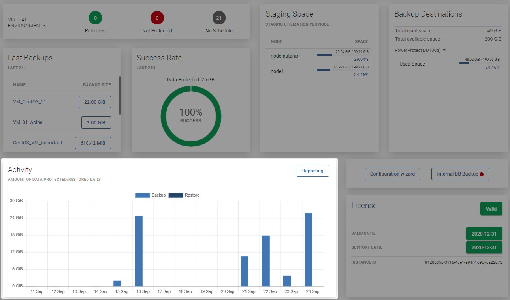
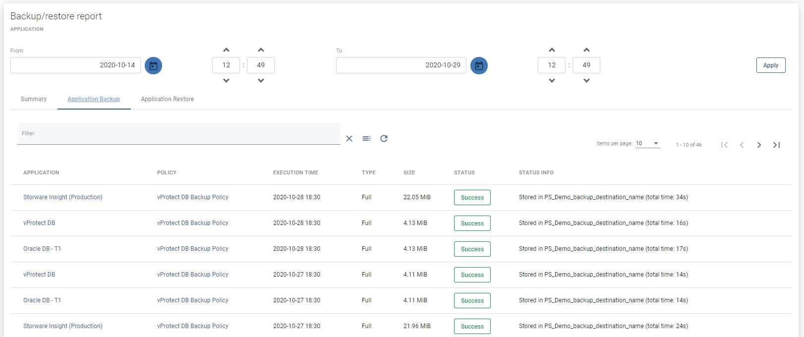

# Applications

vProtect allows a reporting feature to get information about historical activities. You can reach them from the main dashboard under the section "Activity" through  button.

Or by left side menu - Reporting -&gt; Applications

At the beginning, you should see the summary page

From here, you can set a date range or go to a detailed summary of backup and restore jobs.

You can also send this report by email thanks to this button 

