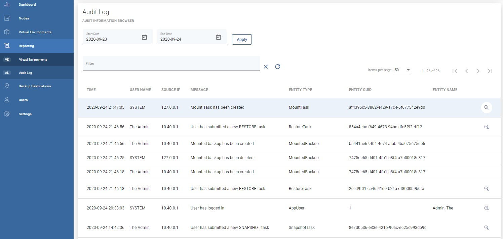
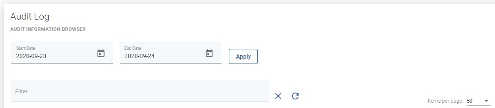
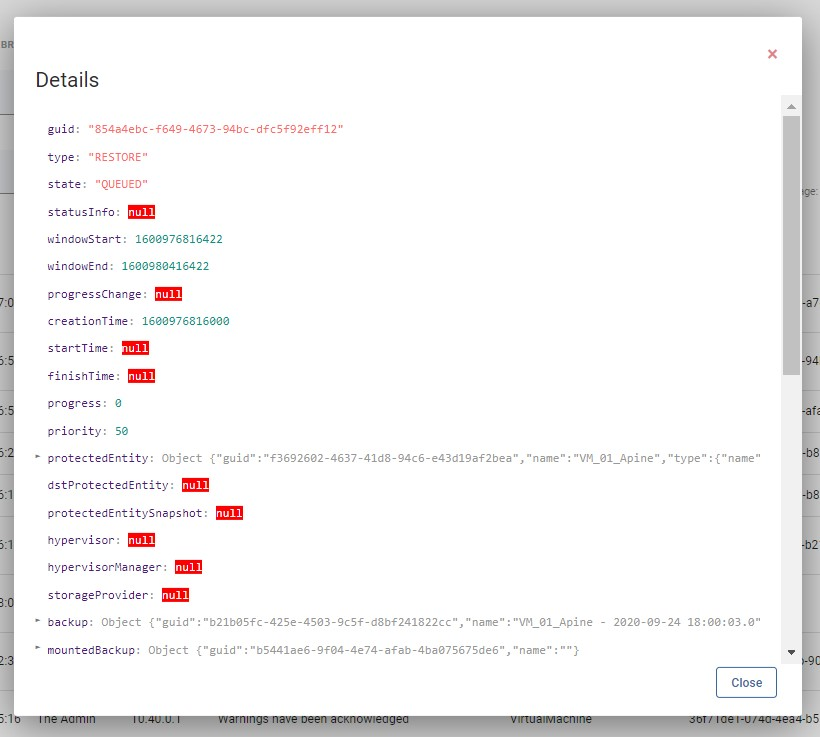

# Audit Log

You can open the Audit log under the reporting section using the left side menu to see what has happened lately in the vProtect environment.

As you can see, you can easily check who logged in / out or what task was done.

Thanks to the filter section at the top of the page, you can easily choose a date range or enter a keyword.

You can also open the task details page using the magnifier icon on the right.

