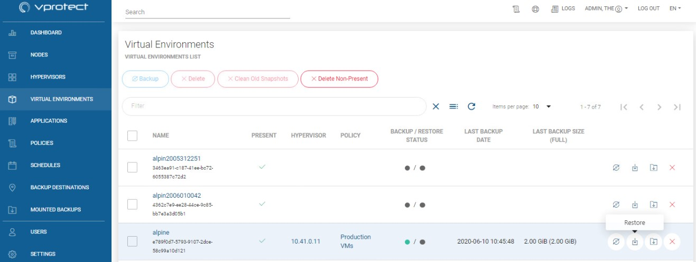
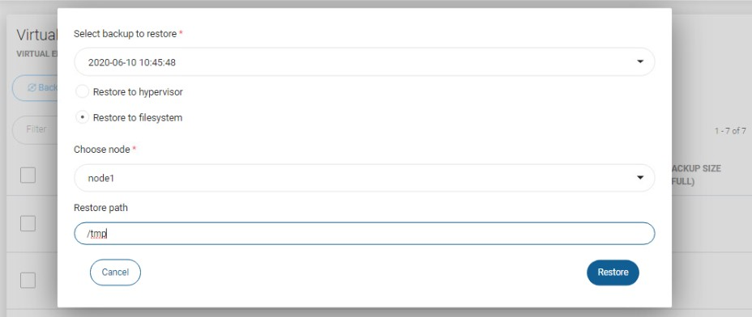
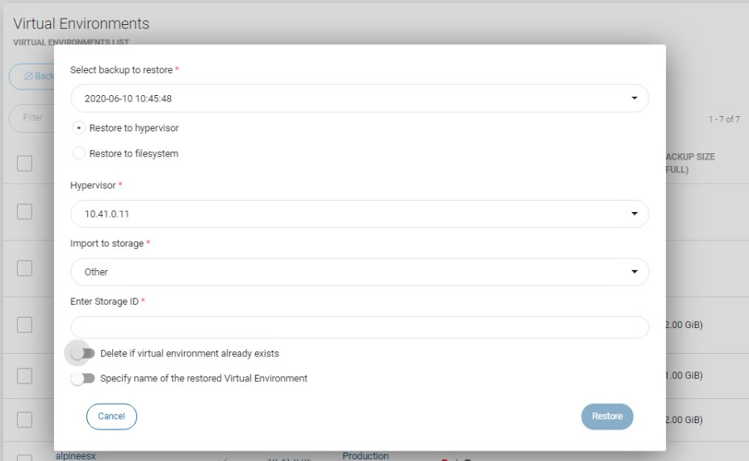
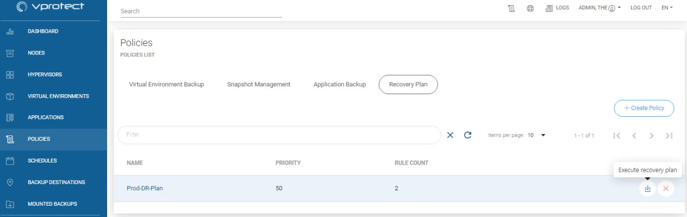
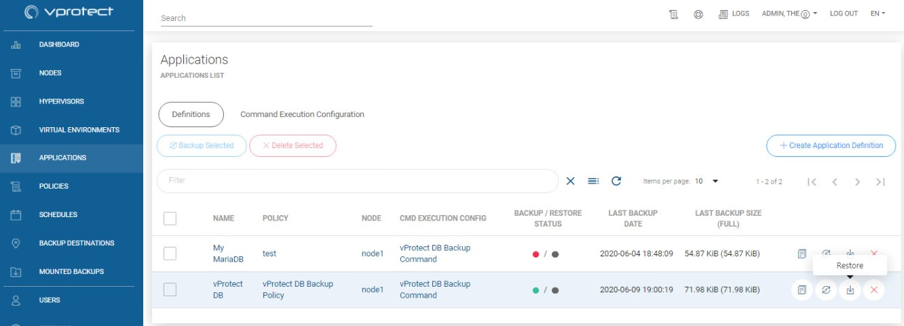
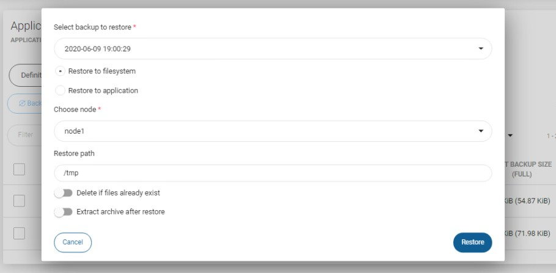
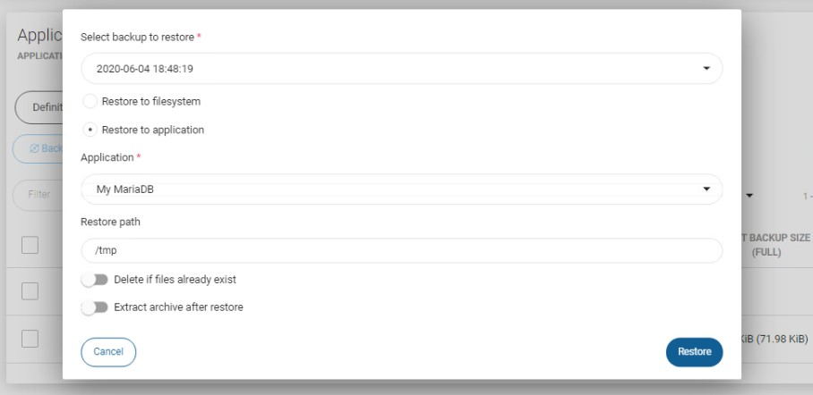
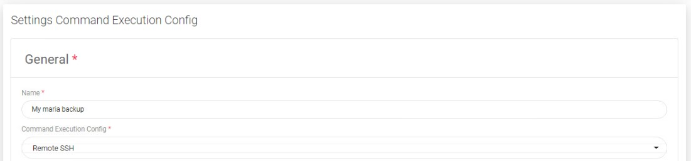

# On-Demand Restore

## Virtual Environments

### Restore from virtual environment menu

To restore a single virtual machine on-demand, go to the Virtual Environment tab.

Click on restore icon next to virtual machine 

Now you should see a popup window where you might customize restore settings.

Restoring to filesystem is an option to restore VMs directly to the vProtect node storage.

Restoring to a hypervisor or hypervisor manager is allowed for several providers, but not for all \(for detailed info go to [vProtect Support Matrix](../../planning/vprotect-support-matrix.md)\).

Finally, after customizing the restore, click the restore button.

**Note:** every platform has some restrictions imposed on the VM name, such as length or characters that can be used. Please verify check these limits before restoring with a custom name.

#### You can also perform the same action thanks to the CLI interface: [CLI Reference](../cli-reference.md#vm-backup-restore)

### Restore on-demand using recovery plans

To restore several virtual machines, you have to use recovery plans. As you can see on the below screenshot, next to recovery plan policy you can find the same icon that allows you to restore virtual machines 

After clicking on it you will see a summary window showing what will be restored.

Click Run to start the restore process.

## Applications

To perform on-demand application restore, please go to application tab on the left side menu.  
You will find restore button  next to application definition 

After clicking on it, you will see pop-up window where you can customize restore options.

If you choose the "Restore to filesystem" option, you can select things like which backup you want to restore, on which node you want to restore files, etc.

The "Restore to application" option differs in that it allows you to restore files to the server where the application is located.

This option is available for applications using "Remote SSH" in the command execution configuration

