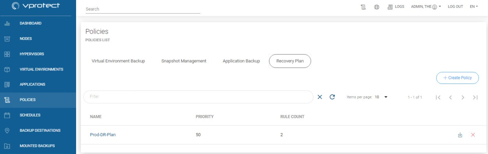
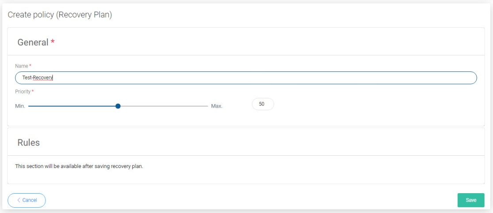
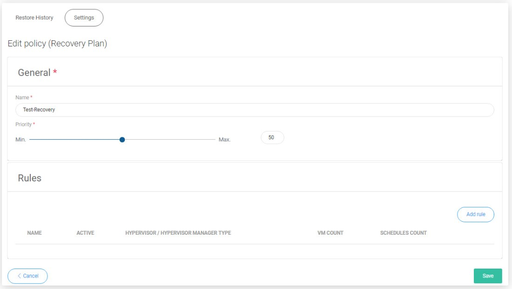
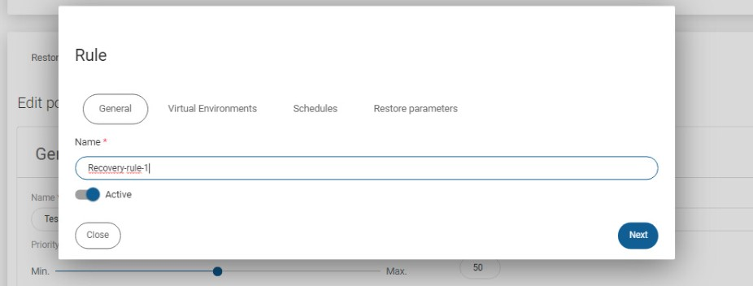
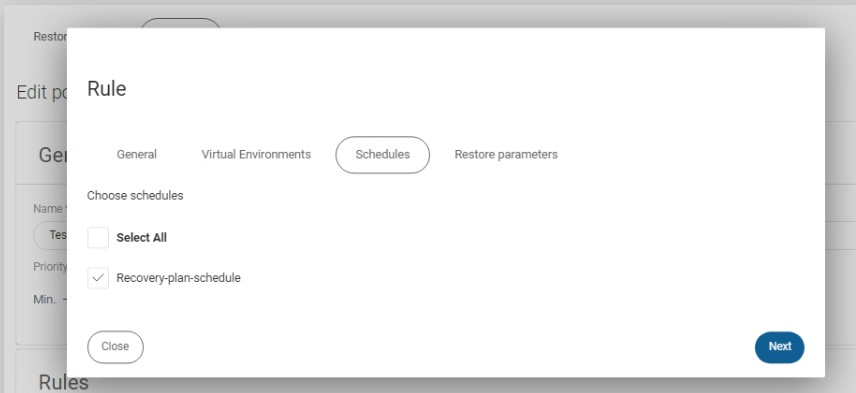
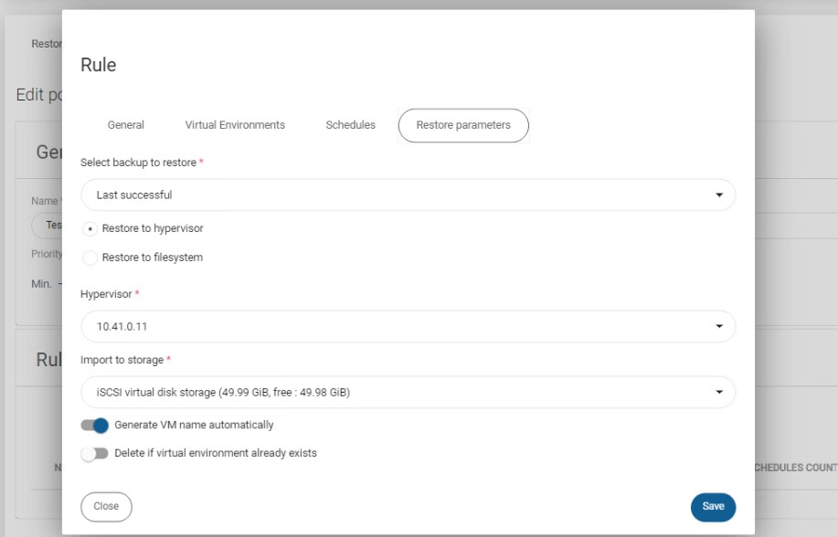

# Scheduled \(Recovery Plans\)

## Virtual Environments

Recovery plans are used to automate DR process, so that vProtect executes multiple restore operations to the target environment with preconfigured settings.

Recovery plans can be executed on-demand or on a scheduled basis \(for instance to test recovery process periodically\). Recovery plans consist of rules, each one for a particular virtualization platform, which specify VMs, restore settings and optionally schedules. Only rules marked as active are executed.

You must start by creating a policy to schedule a restore.

Go to Policies from left menu and then go to Recovery Plan tab.

After clicking on  provide name of policy and set priority. After saving you will be able to add rules using the new button on the right.

Click on it and customize restore settings in new pop-up window.

Each rule requires **name** for easier identification later.

In the **Virtual Environments** tab you need to select **Hypervisor type** for this rule and corresponding **virtual environments** of this type.

If you previously defined any schedules for recovery plans you can select them in **Schedules** tab.

In **Restore Parameters** tab you specify where VMs are going to be restored - compared to regular restore parameters provided in manual restore window, notice that:

* you need to choose which backup to restore **-** last \(regardless of status\) or last successful
* you may want to use **Delete if Virtual Environment already exists** - which allows vProtect to remove VM with the same name as the one being restored

If there is no schedule created already, go to [Recovery Plans Schedules](../schedules/recovery-plans-schedules.md), and create a new one.

