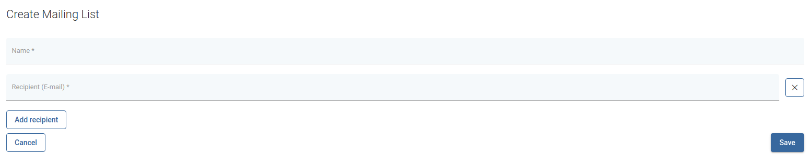

# Mailing lists

It allows you to create mailing list which can be used for sending group raport e-mails.

## Creating new mailing list
To create new list, click on Create button. A new window will appear.

Fill the name for your list and add recipients e-mails by clicking `Add revciepient` button.

After you finished adding reciepients, click `Save` button.

## Mailing list usage
Find the backup policy in which you want to use mailing list and click it to enter `Edit policy` page. Enable `Send daily backup/restore report for VMs assigned to this policy` option and select mailing list.
