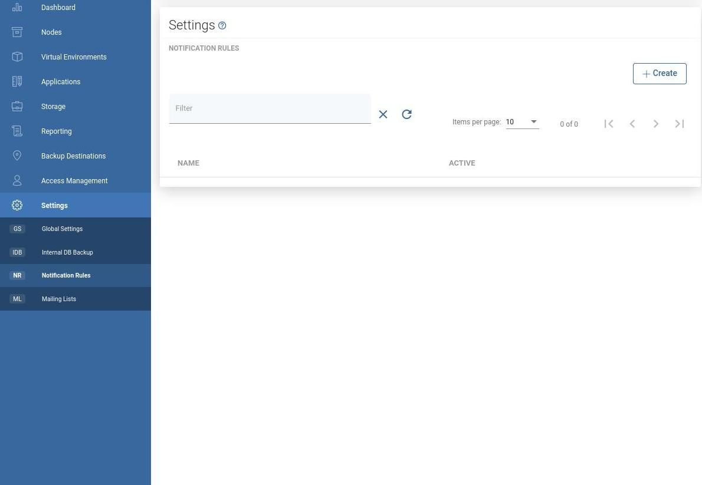
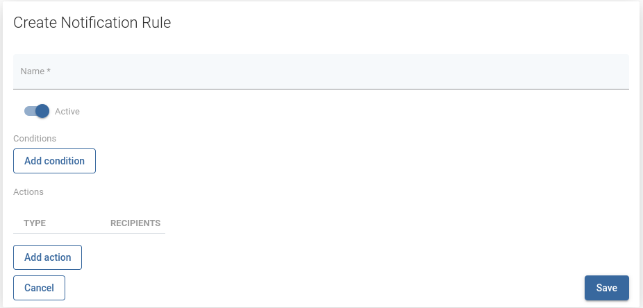
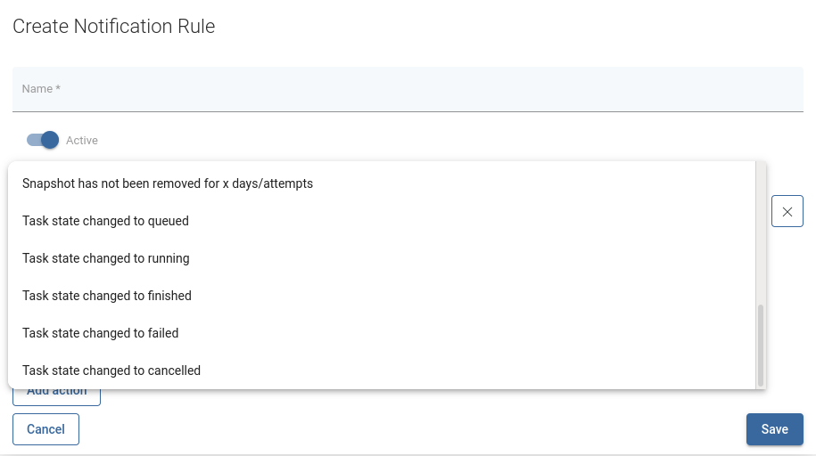
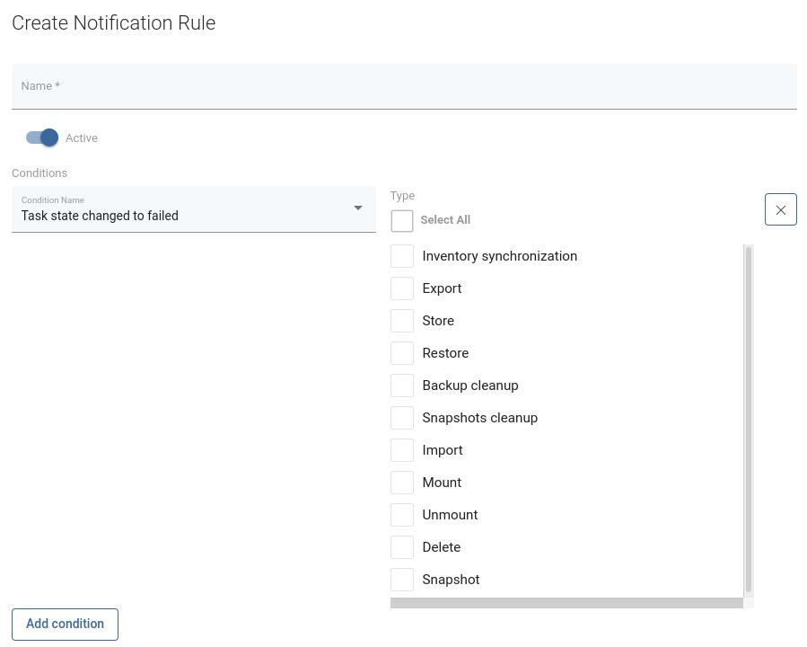
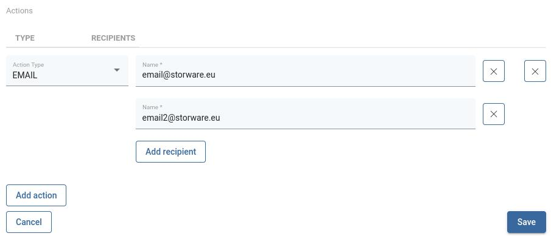
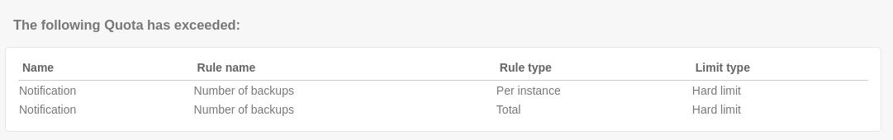

# Notification Rules

## General

vProtect allows a Notification Rules feature to create a semi-custom rule that will send notification triggered by an event specified in rule.   
 Go to Settings on a left menu and then click on Notification Rules button.

### Creating new Notification Rule

To create new rule, simply click on **Create** button. A new window will appear.   

Fill in a name for your rule, set your notification to active and add one or more conditions from a list.   

For some conditions you will need to provide more information, for example choose TaskType.   

Last step is to add an action with related recipients.   
 Click **Add Action** button, choose **Action Type** from a list, add one or more recipients passing their email addresses.

After an event that will trigger notification, all recipients who have been added to notification rule will receive an email notification.   

