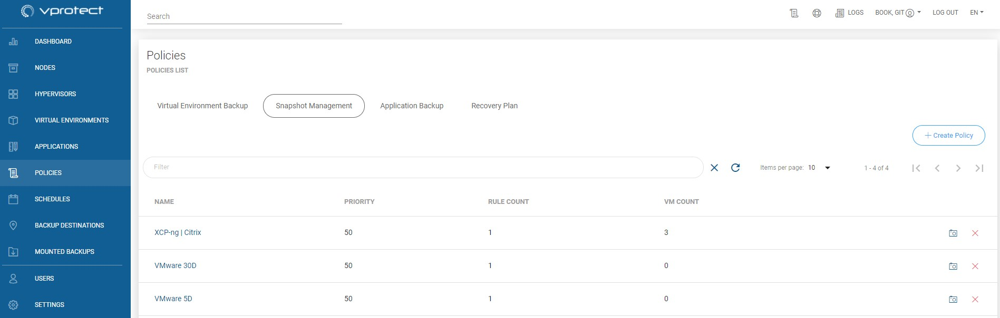
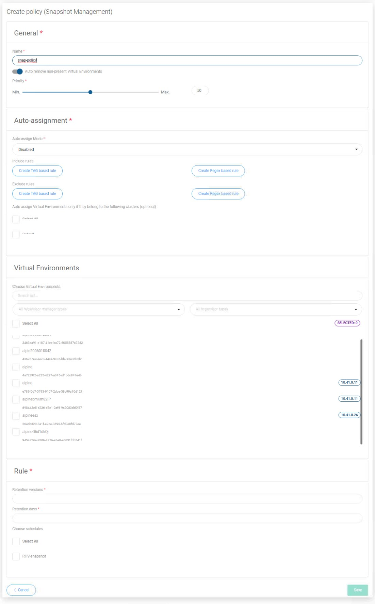

# Snapshot Management

vProtect can periodically create snapshots and keep several of them on every VM. To see which hypervisor support this feature please go to [vProtect Support Matrix](../../planning/vprotect-support-matrix.md).

**Note:** Snapshot management for on-demand or scheduled operations is not available until the virtual machine has a snapshot management policy assigned to it.

In order to enable snapshot management for VM you need to do the following steps:

Go to Policies and create a new Snapshot Management policy 

Just like in other types of rules, you'll find 4 main sections here.

## General

Under this section you can set up:

* Name of policy
* Switch on/off auto remove non-present virtual environments
* Set priority for tasks

## Auto-assignment

In this section you can set up:

* Policy's work mode

  * Disabled
  * Assign only
  * Assign and remove

  _If you decide to second or third work mode, you can create include or exclude rules based on hypervisor tag's or regex rule based on virtual machine name._

* You can also select a cluster to select all virtual machines that belong to it

## Virtual Environments

In this place, you can select virtual machines manually in a simple way.

## Rule

Specify **Rule** details - you need to provide retention settings - how many snapshots \(created by this policy\) will be kept and for how long. If you have already created a schedule, you can also select it.

If you don't have created schedule, go to [Snapshots Schedules](../schedules/snapshots-schedules.md)

### You can also perform the same action thanks to the CLI interface: [CLI Reference](../cli-reference.md#snapshot-management-policies)

