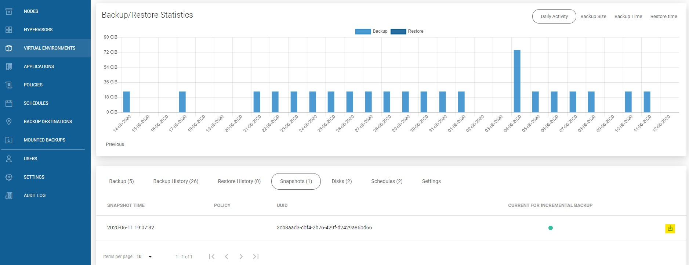

# On-Demand

## Virtual Environments

Once VM is assigned, you'll have new buttons that allow on-demand operations

Next to created policy \(the one with photo camera\) allow you to create snapshot.

In VM details page \(top-right corner\)

And the option to revert snapshots - button on the right side of each of the snapshots on the list \(also in VM details\).

