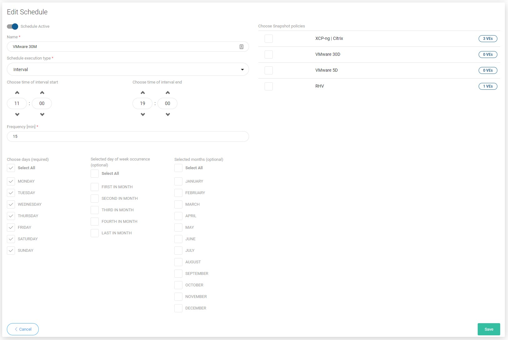

# Scheduled

Schedule defines when and on which days snapshots should be created. To define new schedule use the 

Now provide properties:

* `Schedule Active` - enable or disable schedule execution
* `Name` - schedule name
* `Execution Type` - choose time or interval mode
* `Start Window` - defines how long the task should wait for being executed \(otherwise fails\)
* `Choose time of day` - for time execution mode defines when the task should be added to queue
* `Choose time of interval start` - for interval execution mode defines when tasks should start
* `Choose time of interval end` - for interval execution mode defines until when tasks are executed periodically
* `Frequency` - defines how often task will be executed during the interval
* `Choose days` - last required parameter, select days of the week on which the task will be performed

You can also use optional parameters to further personalize the backup time or select a virtual environment policy if it has been previously created.

