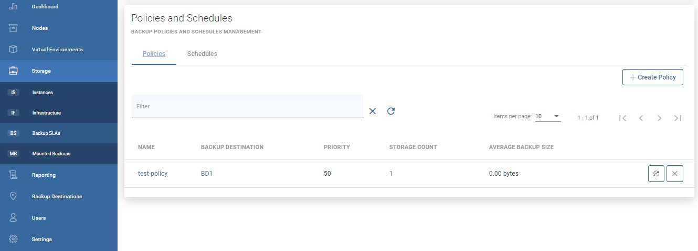
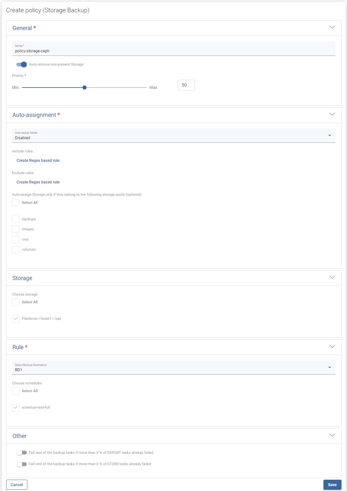

# Policies

Policies allow you to group storage instances in many ways. For example, based on the type of Storage Provider.

To create a new backup policy, please open the Backup SLAs tab under the Storage Provider section and click on  button on the right.

Now you should see the policy wizard with 5 main sections.

## General

Under this section you can set up:

* Name of policy
* Switch on/off auto-remove non-present virtual environments
* Set priority for tasks

## Auto-assignment

In this section you can configure automatic policy assignment based on certain criteria:

* Mode
  * Disabled
  * Assign only
  * Assign and remove
* Include or exclude rules based on regular expression matching storage instance name, i.e.:
  * regular expression examples:
    * `.*` match any character any number of times
    * `st-[0-9][0-9][0-9]` - match name that starts with `st-` and 3 digits
    * `(prod|uat|dev)-[0-9][0-9][0-9][a-z]?` - match name that starts with `prod` or `uat` or `dev` prefix, then `-`, then 3 digits and optional lower-case letter \(matching is case-sensitive\)
  * exclude rules always take precedence over include rules
  * Objects may not be reassigned to the different policy if they already have a matching policy assigned
  * Objects may be reassigned to the different policy only if the mode is `Assign and remove`, current policy assignment rules don't match, and other's policy rules match
  * rules are joined with OR operator, so 
    * if **any** rule \(tag or matched regular expression\) excludes storage instance - it will be excluded
    * if **no** rule \(tag or matched regular expression\) excludes storage instance, and **any** rule \(tag or matched regular expression\) includes VM - it will be included
* You can also select clusters to match only VMs that belong to them

## Storage

Here you can easily select storage instances manually.

## Rule

This section is used to select the backup destination. If you have already created a schedule, you can also select it.

## Other

It is an optional section with two switches:

* Fail rest of the backup tasks if more than xx% of EXPORT tasks already failed
* Fail rest of the backup tasks if more than xx% of STORE tasks already failed

Two examples when using switches is useful It is very likely that if 30% of the backup tasks fail, the remaining tasks will also fail because the environment has failed. Or you are backing up a set of storage instances, and if even one is not secured, there is no point in backing up the rest.

At the end save settings.

### You can also perform the same action thanks to the CLI interface: [CLI Reference](../../cli-reference.md#storage-backup-management)

