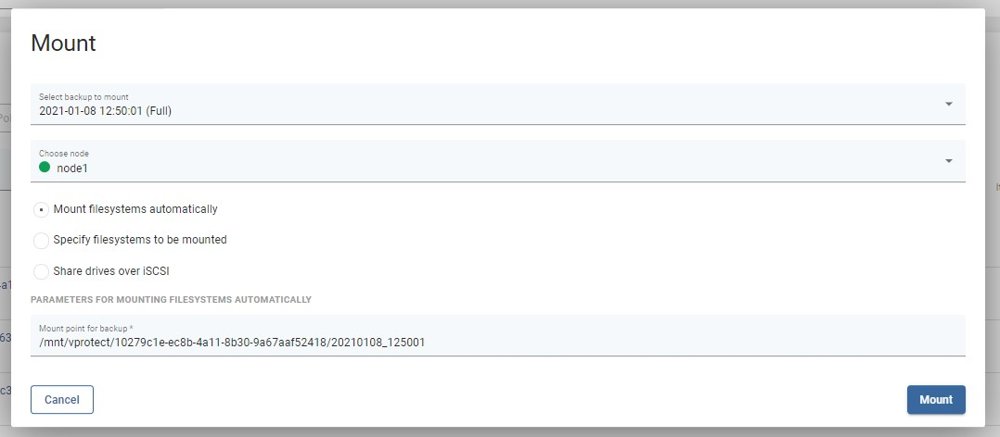
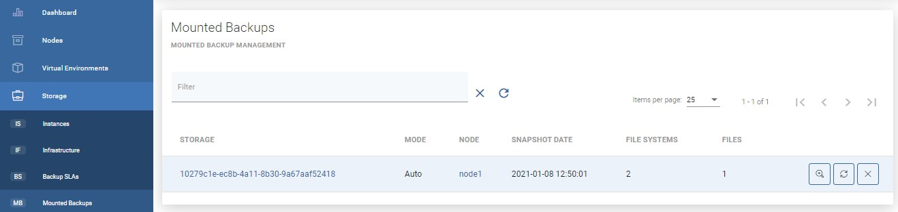
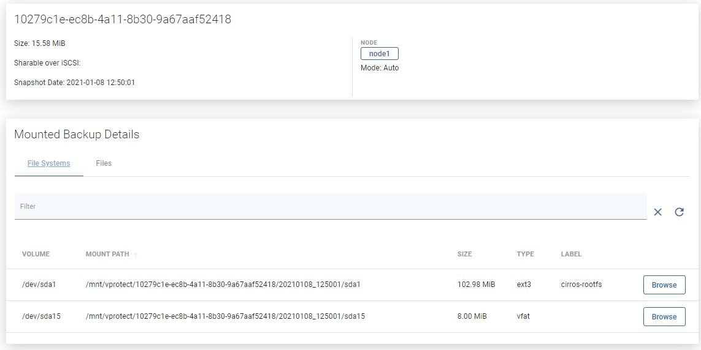

# File-level Restore \(Mounted Backup\)

To mount backup, go to the Instances tab under the Storage Providers section on the left side menu, then click on the mount icon next to the chosen storage instance 

In the popup window, you can select which backup you want to mount and on which node.

The Mounted Backups tab shows mounted storage-instance backups on the vProtect node.

* `Storage` - mounted instance name
* `MODE` - Auto - vProtect auto-detects filesystems and mounts them on the path "/mnt/vprotect/". In Manual mode, the user chooses the mount point for selected filesystems.
* `NODE` - the vProtect node responsible for the mount job.
* `SNAPSHOT DATE` - the date when the backup was created.
* `FILE SYSTEMS` - the number of mounted filesystems.
* `FILES` - the number of mounted virtual disk images.

Next to every mounted backup you can see three buttons:  
To unmount backup click on   
To remount backup click on   
To go to the details page of mounted backup click on 

On the details page, you can view basic information or you can go deeper and browse the files.

With a web browser, you can even obtain a single file from your storage instance backup.

