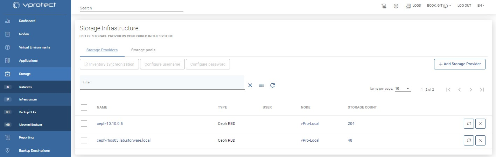
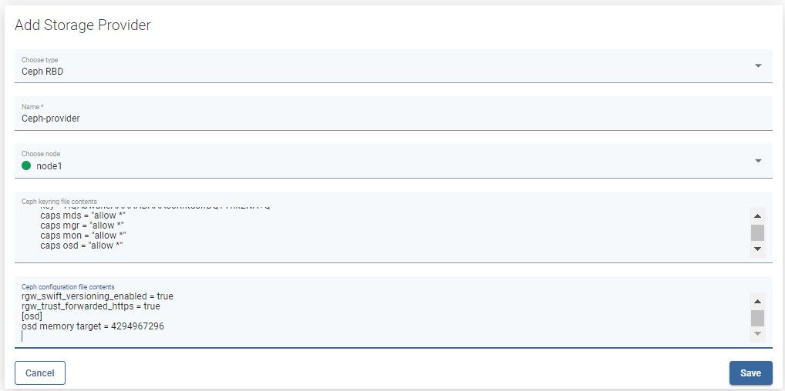
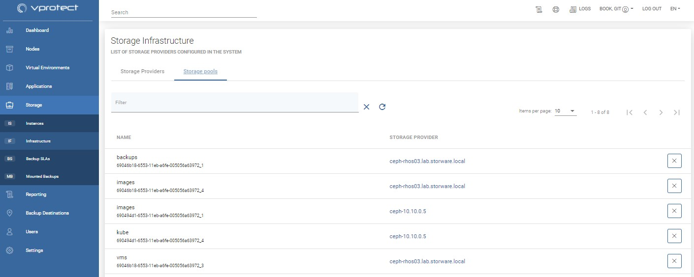

# Infrastructure

This section describes how to manage Storage Providers in vProtect. The inventory that vProtect needs first has to be populated. The first step is always to add a storage provider or file system visible on the vProtect node.

Click Add Storage Provider to add entries

Then synchronize the inventory \(either automatically - a dialog box will be shown just after saving the form, or manually with the button on the right of the storage provider\). If the inventory synchronization tasks \(visible on the console at the bottom\) complete successfully, this also proves that the connection was successful, authentication is correct and all of the inventory items have been collected successfully.

Check the storage pools as well as Storage -&gt; Instances to see the results of the inventory synchronization.

## You can also perform the same action thanks to the CLI interface: [CLI Reference](../cli-reference.md#storage-providers-management)

