# Instances

## General

A list of currently known storage instances and access to the details page of each object. From this place, you can also perform on-demand actions such as backup, restore and file-level restore.

Going back to the Storage details page, this is what it looks like:

As you can see, the window has been divided into several areas:

## Storage instance summary

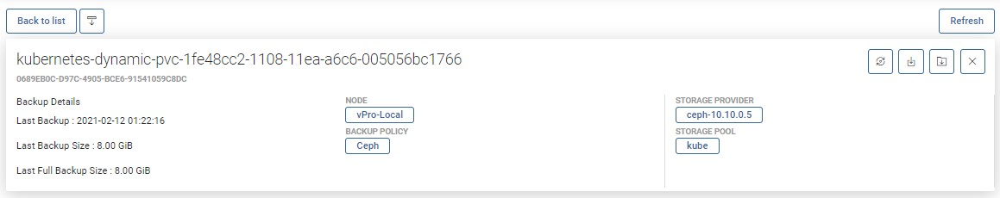

At the top, you can see summarized pieces of information, such as:

* ID of Storage instance into vProtect  
* to which Provider the instance belongs  
* to which Pool the instance belongs
* which node is responsible for backup  
* short information about the last backup actions  
* whether the storage instance has policies assigned to it  

You can also use several function buttons, such as:

* refresh  
* back to list 
* change section order
* backup  
* restore  
* mount  
* delete

## Backup/Restore Statistics

### Daily activity

First, you'll see a daily summary of the backup and restore operations for the last month. This view is called "Daily Summary" and is the default view. You can switch the report between multiple views.

### Backup Size

This view shows separate columns for each backup made. Thanks to this, you can easily determine what data increase occurs on a given machine.

### Backup Time

A very useful report. It allows you to determine the required window length for backups or, based on the time of individual phases, it is easy to deduce the cause of slow backups.

### Transfer Rate

One of the latest reports, now you can easily see how fast data transfer is.

### Restore Duration

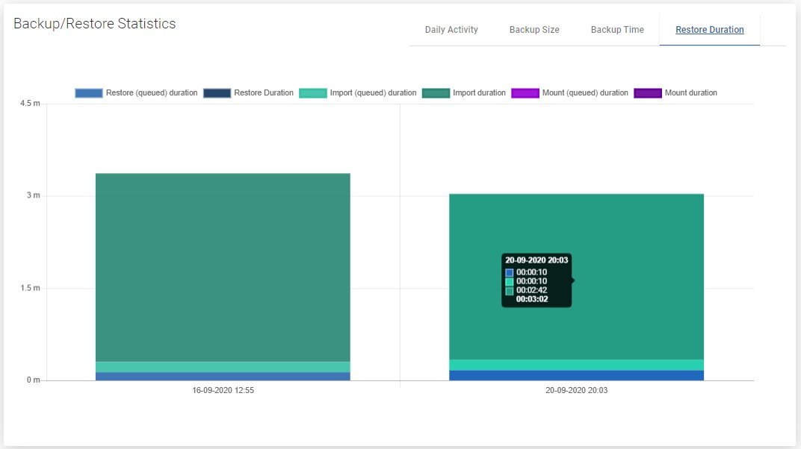

A view with the same properties as "Backup Time". It allows us to estimate how long it will take to restore the storage instance in the event of a failure.

### Restore Rate

As in the previous case, we also have the transfer speed for the restore job.

## Events Calendar

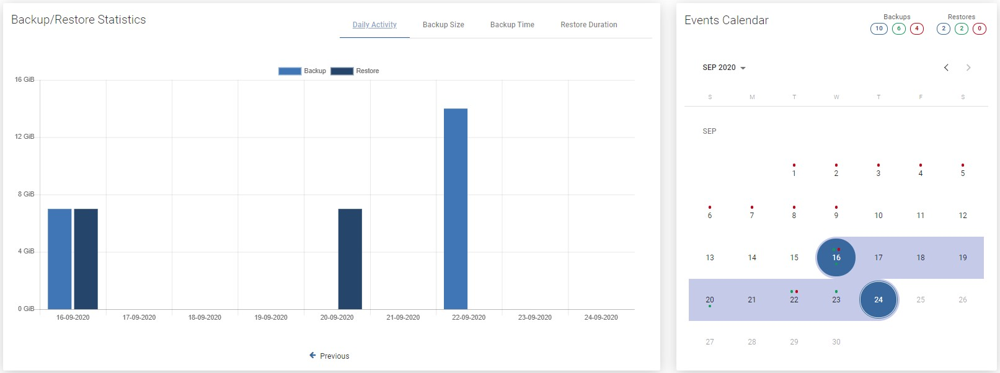

The calendar extends the possibilities of adjacent statistics. It allows you to neatly define the range of days you want to see, additionally makes a quick summary of the number of backups and restores \(top right corner\).  
**Blue** - the sum of all backups, **Green** - the sum of successes, **Red** - the sum of failures.

## Bottom menu

In the bottom menu, you can find a large number of tabs, each of which will present different information or will allow you to change the configuration of this particular storage instance.

### Backup

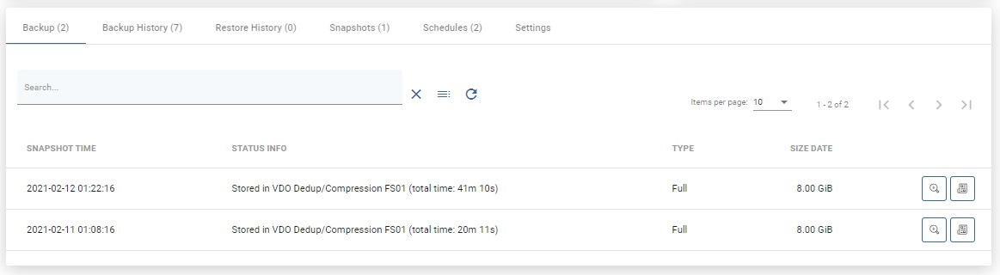

The first tab shows all backups that are currently available and all the basic information about them in a list. After clicking on the magnifying glass button, you will see additional information. The button next to it allows you to download logs in the form of a .txt file.

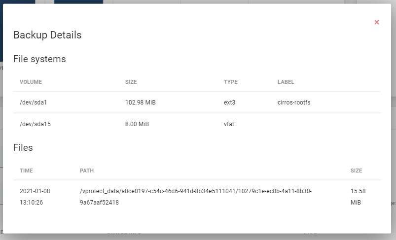

### Backup History

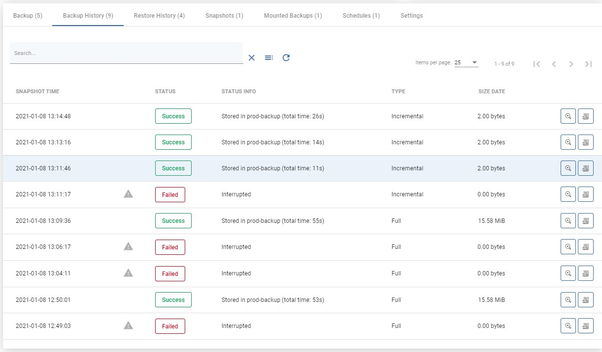

This tab shows information about all backups made. Also about those that failed, were removed \(because of retention\) or are currently executing.

### Restore History

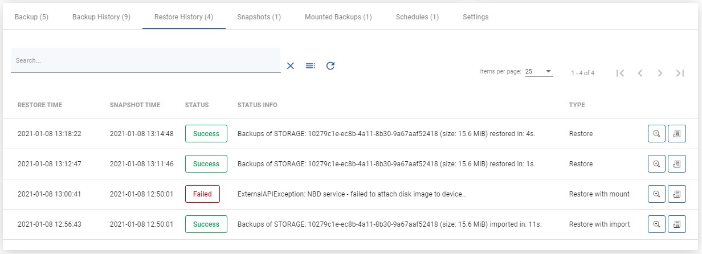

This tab is similar to "Backup History". This is a list with basic information about the storage instance restores performed. When you open the details of the selected restore, you will see much more detailed information.

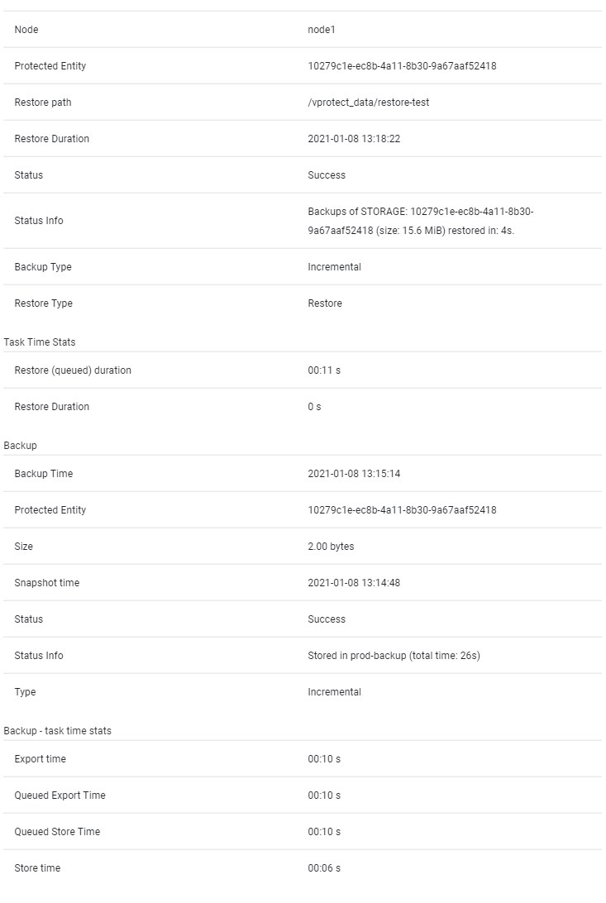

### Snapshots

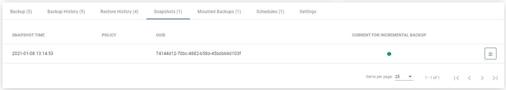

This tab shows the storage instance snapshot - the tab is visible only for the ceph and nutanix Storage Provider.  
As you can see in the list above, there is a green dot next to the snapshot. This means that the snapshot is created for incremental backup purposes. This is an automatic operation and we only keep the last snapshot.

### Mounted Backups

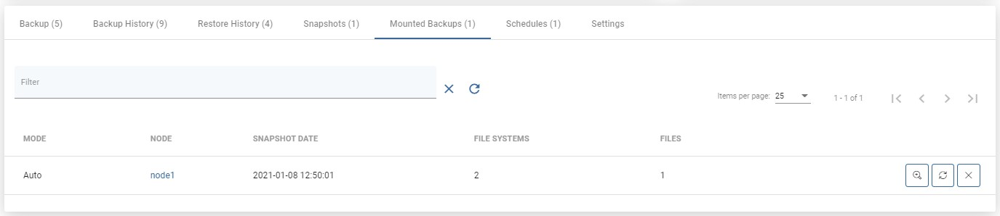

This tab lists all mounted backups of this particular storage instance.  
With the buttons on the right, you can browse/remount/delete it.

### Schedules

On this tab, you can see all the schedules assigned to the instance.

### Settings

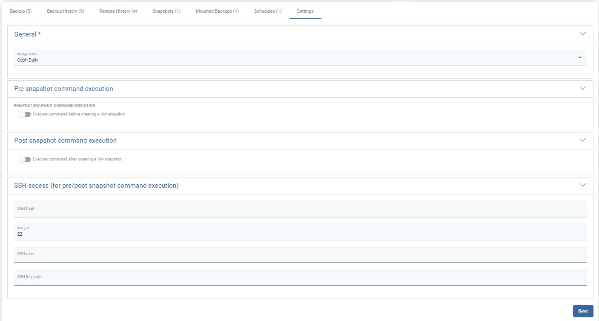

Finally, the last tab. The first option allows you to change the policies assigned to the storage instance.

Performing pre/post snapshot commands is a function intended for advanced users. As the name implies, it allows us to execute scripts via an ssh connection, either before or after taking a snapshot.

