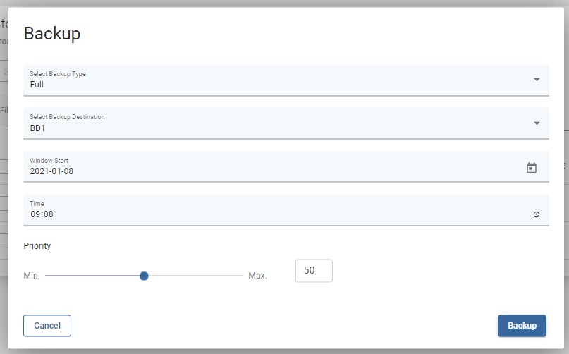

# Backup on-demand

## Storage List

To perform on-demand backup go to the instances tab under the Storage Providers section.

You can click on  icon to backup a single storage instance

Or select multiple instances and click on icon to backup them.

Finally select a backup type, backup destination, when a task should start, priority, and click on the backup button.

### You can also perform the same action thanks to the CLI interface: [CLI Reference](../../cli-reference.md#storage-backup-management)

