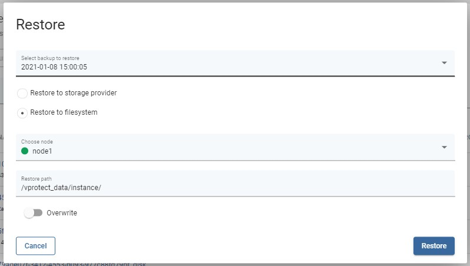
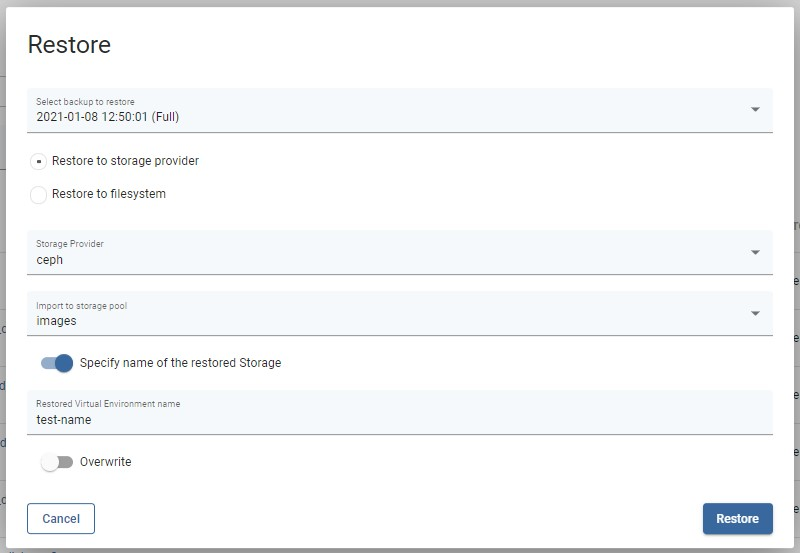

# Restore on-demand

## Restore from Storage Providers menu

To restore a single storage instance on-demand, go to the instances tab under the Storage Providers section. Click on the restore icon next to the object 

Now you should see a popup window where you can customize the restore settings.

Restoring to the filesystem is an option to restore directly to the vProtect node storage.  
\(Remember, the vprotect user must have the appropriate write permissions to the given path.\)

You can also restore the backup to the storage provider from which the backup was created.

Finally, after customizing the restore, click the restore button.

**Note:** every platform has some restrictions imposed on the storage instance name, such as length or characters that can be used. Please check these limits before restoring with a custom name.

### You can also perform the same action using the CLI interface: [CLI Reference](../../cli-reference.md#storage-backup-management)

