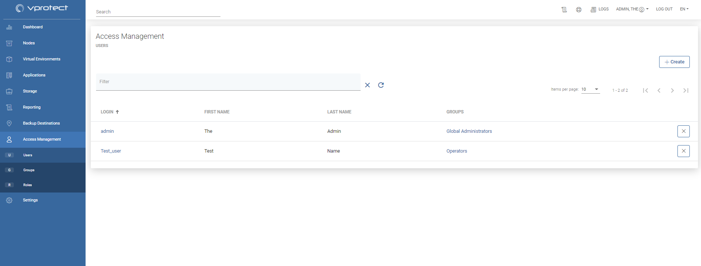
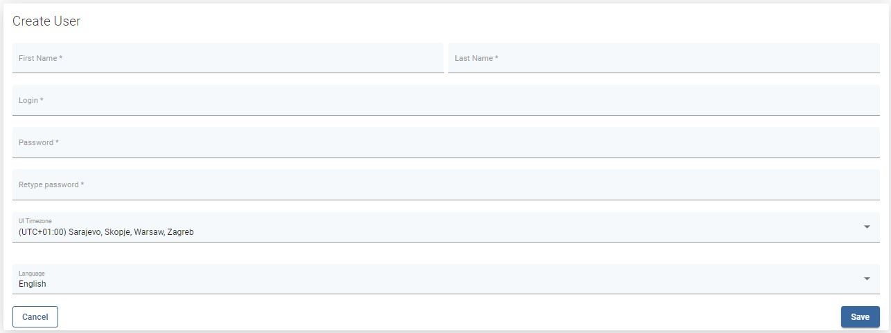

# Access Management

This section allows you to manage Users, Groups and Roles. The role is a set of permissions in vProtect. User can belong to multiple groups. Each group can have multiple roles assigned.

## Users

There are two types of users:

* local users 
* LDAP users \(please refer to how [setup LDAP authentication](settings.md#authentication)\)

To create a new user, click the button on the right 

Complete the following parameters:

* First Name
* Last Name
* Password
* Timezone
* Language

Save, and now you can add this account to the specific group. In the Groups section, click on the name of the group and add a user.

## Groups

Group is a central place to bind together a set of roles with users. There are already a set of predefined groups in vProtect.

**Note:**

* Administrators from previous versions have been migrated to `Global Administrators` group with all permissions available.
* automatically created accounts based on LDAP logins will have by default `Operators`
* currently groups are managed in vProtect UI only \(they are not mapped to LDAP groups\)

## Roles

Role is a set of permissions to the different sections and actions in vProtect. When multiple roles are assigned to the Group, the resulting permissions will be the sum of all permissions from all assigned roles.

**Note:**

* It is mandatory to have always at least one account with permission to manage Users
  * in other words: at least one account must be assigned to the group, which has a role with this permission.

## Permissions

<table>
  <thead>
    <tr>
      <th style="text-align:left">Section (Name)</th>
      <th style="text-align:left">Permission</th>
      <th style="text-align:left">Allows</th>
    </tr>
  </thead>
  <tbody>
    <tr>
      <td style="text-align:left">Dashboard</td>
      <td style="text-align:left">Dashboard</td>
      <td style="text-align:left">This permission allows to enable or disable access to the entire WebUI.
        The user for whom we disable the dashboard will be able to perform actions
        only from the CLI</td>
    </tr>
    <tr>
      <td style="text-align:left">Dashboard</td>
      <td style="text-align:left">Configuration Wizard</td>
      <td style="text-align:left">This permission hides or shows the wizard button. Please note that tasks
        performed from the wizard level (e.g. adding a hypervisor) require separate
        permissions available from other sections.</td>
    </tr>
    <tr>
      <td style="text-align:left">Nodes</td>
      <td style="text-align:left">Instances</td>
      <td style="text-align:left">
        
Read - allows you to view the list of instances and basic information
          Register - allows you to register new nodes in the environment

        
Write - allows you to change selected node config

        
Delete - allows you to remove a node from the environment

      </td>
    </tr>
    <tr>
      <td style="text-align:left">Nodes</td>
      <td style="text-align:left">Node Configurations</td>
      <td style="text-align:left">
        
Read - allows you to browse the list of configs and open them

        
Write - allows you to modify existing configs and create new ones

      </td>
    </tr>
    <tr>
      <td style="text-align:left">Virtual Environments</td>
      <td style="text-align:left">Instances</td>
      <td style="text-align:left">
        
Read - allows you to browse the list of instances and open them

        
Write - allows you to modify virtual machine settings

        
Backup - allows you to perform a manual backup

        
Restore - allows you to perform a manual restore

        
Snapshot - allows you to perform a manual snapshot

        
Mount - allows you to mount a backup for file-level restore

        
Clean old Snapshot - allows you to perform the &quot;Clean old snapshot&quot;
          task

      </td>
    </tr>
    <tr>
      <td style="text-align:left">Virtual Environments</td>
      <td style="text-align:left">Infrastructure</td>
      <td style="text-align:left">
        
Read - allows you to browse the list of infrastructure objects for all
          tabs

        
Write - allows you to modify settings for existing objects and to add
          new ones

        
Test Connectivity - This permission allows you to enable or disable access
          to the connectivity test

      </td>
    </tr>
    <tr>
      <td style="text-align:left">Virtual Environments</td>
      <td style="text-align:left">Backup SLAs</td>
      <td style="text-align:left">
        
Read - allows you to browse the list of policies and schedules

        
Write - allows you to modify the existing and add new ones

      </td>
    </tr>
    <tr>
      <td style="text-align:left">Virtual Environments</td>
      <td style="text-align:left">Snapshot SLAs</td>
      <td style="text-align:left">
        
Read - allows you to browse the list of policies and schedules

        
Write - allows you to modify the existing and add new ones

      </td>
    </tr>
    <tr>
      <td style="text-align:left">Virtual Environments</td>
      <td style="text-align:left">Recovery Plans</td>
      <td style="text-align:left">
        
Read - allows you to browse the list of policies and schedules

        
Write - allows you to modify the existing and add new ones

      </td>
    </tr>
    <tr>
      <td style="text-align:left">Virtual Environments</td>
      <td style="text-align:left">Mounted Backups</td>
      <td style="text-align:left">
        
Read - allows you to browse the list of mounted backups and also to download
          files

        
Unmount - allows you to unmount a backup

      </td>
    </tr>
    <tr>
      <td style="text-align:left">Applications</td>
      <td style="text-align:left">Instances</td>
      <td style="text-align:left">
        
Read - allows you to browse the list of instances and open them

        
Write - allows you to modify virtual machine settings

        
Backup - allows you to perform a manual backup

        
Restore - allows you to perform a manual restore

      </td>
    </tr>
    <tr>
      <td style="text-align:left">Applications</td>
      <td style="text-align:left">Execution Configurations</td>
      <td style="text-align:left">
        
Read - allows you to browse the list of execution configs

        
Write - allows you to modify the existing and add new ones

      </td>
    </tr>
    <tr>
      <td style="text-align:left">Applications</td>
      <td style="text-align:left">Backup SLAs</td>
      <td style="text-align:left">
        
Read - allows you to browse the list of policies and schedules

        
Write - allows you to modify the existing and add new ones

      </td>
    </tr>
    <tr>
      <td style="text-align:left">Storage</td>
      <td style="text-align:left">Instances</td>
      <td style="text-align:left">
        
Read - allows you to browse the list of instances and open them

        
Write - allows you to modify storage instance settings

        
Backup - allows you to perform a manual backup

        
Restore - allows you to perform a manual restore

        
Snapshot - allows you to perform a manual snapshot

        
Mount - allows you to mount a backup for file-level restore

        
Clean old Snapshot - allows you to perform the &quot;Clean old snapshot&quot;
          task

      </td>
    </tr>
    <tr>
      <td style="text-align:left">Storage</td>
      <td style="text-align:left">Infrastructure</td>
      <td style="text-align:left">
        
Read - allows you to browse the list of infrastructure objects for all
          tabs

        
Write - allows you to modify settings for existing objects and to add
          new ones

        
Test Connectivity - This permission allows you to enable or disable access
          to the connectivity test

      </td>
    </tr>
    <tr>
      <td style="text-align:left">Storage</td>
      <td style="text-align:left">Backup SLAs</td>
      <td style="text-align:left">
        
Read - allows you to browse the list of policies and schedules

        
Write - allows you to modify the existing and add new ones

      </td>
    </tr>
    <tr>
      <td style="text-align:left">Storage</td>
      <td style="text-align:left">Snapshot SLAs</td>
      <td style="text-align:left">
        
Read - allows you to browse the list of policies and schedules

        
Write - allows you to modify the existing and add new ones

      </td>
    </tr>
    <tr>
      <td style="text-align:left">Storage</td>
      <td style="text-align:left">Mounted Backups</td>
      <td style="text-align:left">
        
Read - allows you to browse the list of mounted backups and also to download
          files

        
Unmount - allows you to unmount a backup

      </td>
    </tr>
    <tr>
      <td style="text-align:left">Reporting</td>
      <td style="text-align:left">Reporting</td>
      <td style="text-align:left">Read - allows you to view report data for virtual machines and storage
        providers Send report - This permission allows you to enable or disable
        the ability to send the report by mail</td>
    </tr>
    <tr>
      <td style="text-align:left">Reporting</td>
      <td style="text-align:left">Audit Log</td>
      <td style="text-align:left">Read - This permission allows you to enable or disable access to the audit
        log report</td>
    </tr>
    <tr>
      <td style="text-align:left">Backup Destinations</td>
      <td style="text-align:left">Backup Destination</td>
      <td style="text-align:left">
        
Read - allows you to browse the list of backup destinations

        
Write - allows you to modify settings for existing objects and to add
          new ones

        
Test Connectivity - This permission allows you to enable or disable access
          to the connectivity test

        
Clean old backups - This permission allows you to enable or disable the
          ability to perform this task

      </td>
    </tr>
    <tr>
      <td style="text-align:left">Access Management</td>
      <td style="text-align:left">Access Management</td>
      <td style="text-align:left">
        
Read - allows you to browse the list of objects for all access management
          tabs

        
Write - allows you to modify existing objects and to add new ones

        
Change passwords - allows you to change user passwords

      </td>
    </tr>
    <tr>
      <td style="text-align:left">Settings</td>
      <td style="text-align:left">Settings</td>
      <td style="text-align:left">
        
Read - allows you to view selected settings for all tabs in the &quot;settings&quot;
          section

        
Write - allows you to modify settings for all tabs in the &quot;settings&quot;
          section

      </td>
    </tr>
    <tr>
      <td style="text-align:left">Tasks Console</td>
      <td style="text-align:left">Tasks Console</td>
      <td style="text-align:left">
        
Read - this permission allows you to hide or show the &quot;Task Console&quot;
          floating panel

        
Write - allows you to remove/cancel tasks from the list

      </td>
    </tr>
    <tr>
      <td style="text-align:left">Restore Job</td>
      <td style="text-align:left">Restore Job</td>
      <td style="text-align:left">Read - This permission allows you to enable or disable access to the information
        about restore tasks - under tasks console, details of virtual machine or
        storage instance and from recovery plans</td>
    </tr>
  </tbody>
</table>

