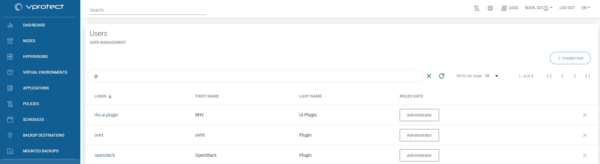
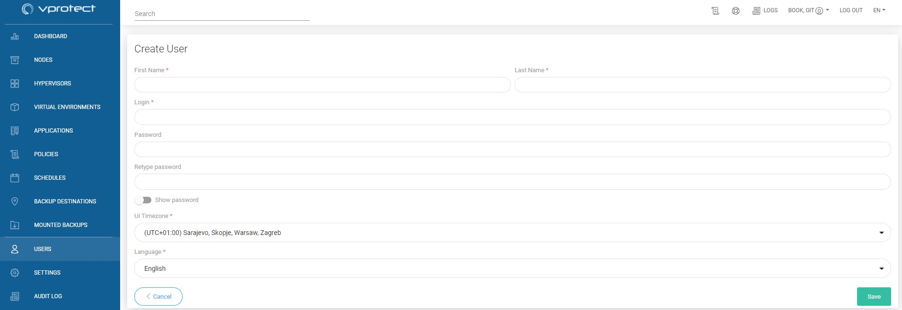

# User Management

If you want to manage vProtect account or create a new one, please open user tab on the left side menu.

There are two types of users with only administrator role:

* local users 
* LDAP users \(please refer how to [setup LDAP authentication](settings.md#authentication)\)

To create a new user, click the button on the right  .

All you need to do is fill out a few information about the new user:

* First Name
* Last Name
* Password
* Timezone
* Language

Save, that's all. Now you can use the new account

