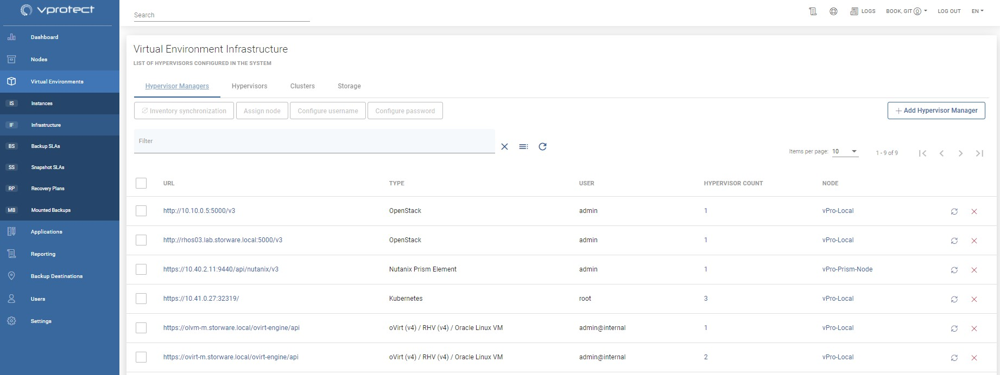
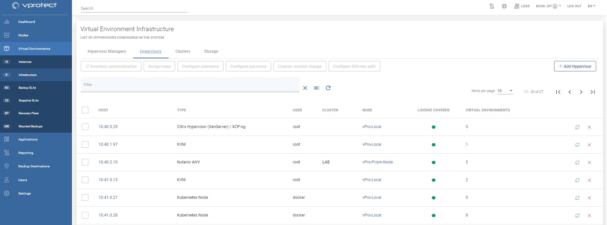

# Infrastructure

This section describes how to manage hypervisors and their managers in vProtect. Inventory that vProtect needs first to be populated. The first step is always to add a hypervisor manager \(if it virtualization platform supports a dedicated manager\) or individual hypervisors \(if these are not managed, but are stand-alone\).

You also can verify if your Hypervisor Storage \(datastores/storage repositories/storage domains, depending on how different platforms call it\) or Hypervisor Clusters \(which corresponds to server pools/ clusters/availability zones\) that have been detected.

Click Add Hypervisor Manager / Add Hypervisor to add entries and in general, you always need to provide:

* URL \(hypervisor manager - valid URLs are described in the sections describing the setup of a particular virtual platform type\) or hostname/IP \(hypervisor\)
* the node which is responsible for executing tasks in this environment
* backup strategy - if available for a particular platform

Then synchronize inventory \(either automatically - there will be a dialog box shown just after saving the form or manually with the button on the right of hypervisor or manager\). If Inventory Synchronization tasks \(visible in the console at the bottom\) completes successfully it also proves that connection was successful, credentials are correct and all of the inventory items have been collected successfully.

Check Hypervisor Storage, Hypervisor Clusters tabs, as well as Virtual Environments -&gt; Instances to see the results of inventory synchronization.

**Note:**

* inventory synchronization executed on the manager level assigns the same node as used for the manager to all hypervisors - you can override it in the Hypervisor tab and assign a different node to handle VMs that reside on a specific hypervisor - this is especially important for scalability and when environments are divided into multiple clusters \(disk-attachments strategies may not be able to access disks from different clusters\)
* if you use **disk-attachment** strategy - always execute **inventory synchronization at least once from each hypervisor** - the end result will be the same from the inventory point of view, but each node needs to detect its own Proxy VM ID in the environment to attach disks to the correct VM

