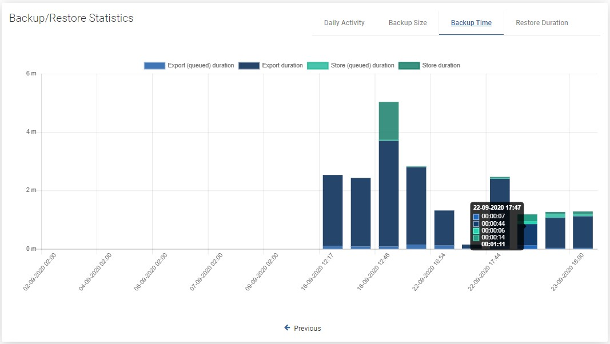

# Instances

## General

List of currently known virtual machines and access to the details page of each object. From this place, you can also perform on-demand actions like backup, restore and file-level restore.

Going back to the VM details page, this is how it looks like:

As you can see, the window has been divided into several areas:

## VM Summary

On the top, you can see summarized pieces of information about VM, like:

* ID of VM object into vProtect  
* to which hypervisor VM belongs  
* which node is backing up this virtual machine  
* shot information about the last backup actions  
* whether the virtual machine has tags or policies assigned to it  

You can also use several function buttons, like:

* refresh  
* back to list  
* backup  
* restore  
* mount  
* delete

## Backup/Restore Statistics

### Daily activity

First, you'll see a daily summary of the backup and restore operations for the last month. This view is called "Daily Summary" and is the default view. You can switch the report between four views.

### Backup Size

This view shows separate columns for each backup made to the virtual machine. Thanks to this, you can easily determine what data increase occurs on a given machine.

### Backup Time

A very useful report. It allows you to determine the required window length for backups or, based on the time of individual phases, it is easy to deduce the cause of slow backups.

### Restore Duration

A view with the same properties as "Backup Time". It allows us to estimate how long it will take to restore the machine in the event of a failure.

## Events Calendar

The calendar extends the possibilities of adjacent statistics. It allows you to neatly define the range of days you want to see, additionally makes a quick summary of the number of backups and restores \(top right corner\).  
**Blue** - the sum of all backups, **Green** - the sum of successes, **Red** - the sum of failures.

## Bottom menu

In the bottom menu, you can find a large number of tabs, each of which will present different information or will allow you to change the configuration of this particular virtual machine.

### Backup

The first tab shows all virtual machine backups that are currently available and all basic information about them in a list. After pressing the magnifying glass button, you will see additional information. The button next to it allows you to download logs in the form of a .txt file.

### Backup History

This tab shows information about all backups made for this virtual machine. Also about failed, removed \(because of retention\) or currently executing.

### Restore History

This tab is similar to "Backup History". This is a list with basic information about the virtual machine restores performed. When you open the details of the selected restore, you will see much more detailed information.

### Snapshots

This tab shows the virtual machine snapshots \(remember - snapshots are stored on the hypervisor\). The snapshot can be divided into two categories:  
1. As you can see in the list above, there is a green dot next to the snapshot. This means that this snapshot is created for incremental backup purposes. This is an automatic operation and we only keep the last snapshot.  
2. The second on the list is a snapshot created at the user's request \(scheduled or manual\).

Next to the snapshot is a button that allows you to restore the virtual machine. It actually creates a new virtual machine and keeps the old one \(security considerations to protect against the human factor\).

### Disks

It is worth remembering that if such a virtual machine is restored, the excluded disks will be created from scratch and connected to the machine.

### Schedules

In this tab, you can see all the schedules assigned to the virtual machine.

### Settings

Finally, the last tab. The first two options allow you to change the policies assigned to the virtual machine. The third is a toggle to turn on or off the "Snapshot consistent technology" feature.

Performing pre/post snapshot commands is a function intended for advanced users. As the name implies, it allows us to execute scripts via an ssh connection, either before or after taking a snapshot.

