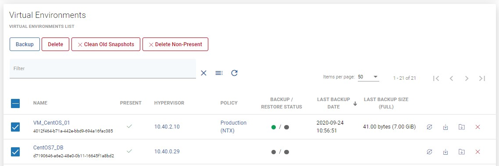
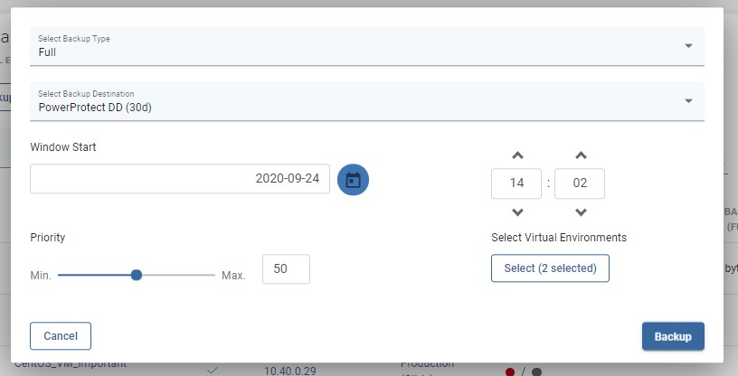
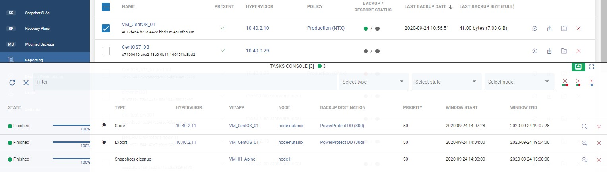

# Backup on-demand

## Virtual Environments

To perform on-demand backup go to the instances tab under the Virtual Environment section.

You can click on  icon to backup one VM

Or select multiple virtual machines and click on  icon to backup it.

Finally select a backup type, backup destination, when a task should start, priority and click on the backup button.

On the Tasks Console, you can see the progress of the backup task.

### You can also perform the same action thanks to the CLI interface: [CLI Reference](backup-on-demand.md)

