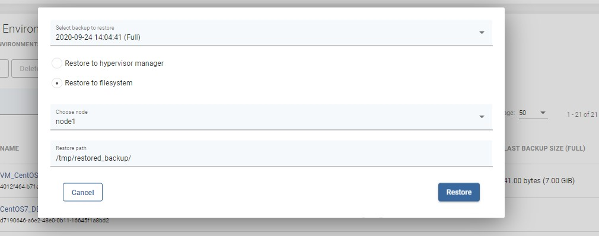
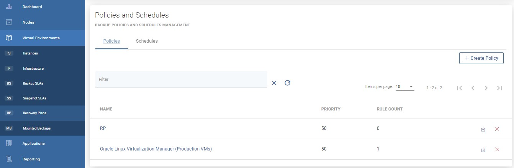
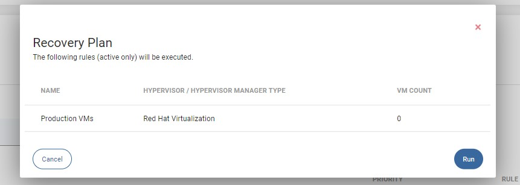

# Restore on-demand

## Restore from virtual environment menu

To restore a single virtual machine on-demand, go to the instances tab under the Virtual Environment section. Click on the restore icon next to the virtual machine 

Now you should see a popup window where you might customize restore settings.

Restoring to the filesystem is an option to restore VMs directly to the vProtect node storage.  
\(Remember, the vprotect user must have the appropriate write permissions to the given path.\)

Restoring to a hypervisor or hypervisor manager is allowed for several providers, but not for all \(for detailed info go to [vProtect Support Matrix](../../../planning/vprotect-support-matrix.md)\).

Finally, after customizing the restore, click the restore button.

**Note:** every platform has some restrictions imposed on the VM name, such as length or characters that can be used. Please verify these limits before restoring with a custom name.

### You can also perform the same action thanks to the CLI interface: [CLI Reference](restore-on-demand.md)

## Restore on-demand using recovery plans

To restore several virtual machines, you have to use recovery plans. As you can see on the below screenshot, next to the recovery plan policy you can find the same icon that allows you to restore virtual machines 

After clicking on it you will see a summary window showing what will be restored.

Click Run to start the restore process.

