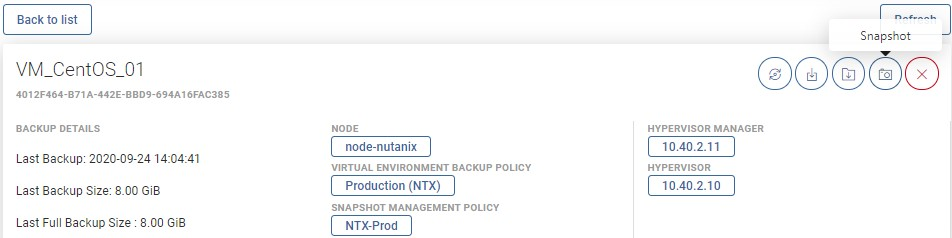
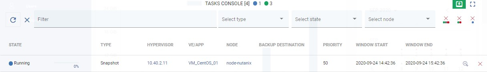

# Snapshot Management

vProtect can periodically create snapshots and keep several of them on every VM. To see which hypervisor support this feature please go to [vProtect Support Matrix](../../../planning/vprotect-support-matrix.md).

Snapshots are kept in the virtualization platform and are not exported with the backup. It allows quick recovery of a VM without the need to restore and import data backup to the hypervisor. Snapshots cannot replace backup, but allow to increase RPO when used together with backups. Snapshot chains may impact VM performance and occupy significant additional space depending on the storage setup in the environment, so we recommend keeping low values for the number of kept snapshots in the policy, i.e. less than 3 and check the documentation of your environment and storage setup for aspects related to possible implications of keeping snapshots.

**Note:** Snapshot management for on-demand or scheduled operations is not available until the virtual machine has a snapshot management policy assigned to it.  
In order to enable snapshot management for VM you need to follow the steps in this article:  
[Snapshot SLAs](../snapshot-slas/)

Once VM is assigned, you'll have new buttons that allow on-demand operations. After opening the virtual machine details page, you can see the camera button in the upper right corner.

After pressing the button, the snapshot will be taken immediately, without additional confirmation.

You can also revert the snapshot from the virtual machine details page.

Next to the snapshot is a button that allows you to restore the virtual machine. It actually creates a new virtual machine and keeps the old one \(security considerations to protect against the human factor\).

## You can also perform the same action thanks to the CLI interface: [CLI Reference](snapshot-management.md)

