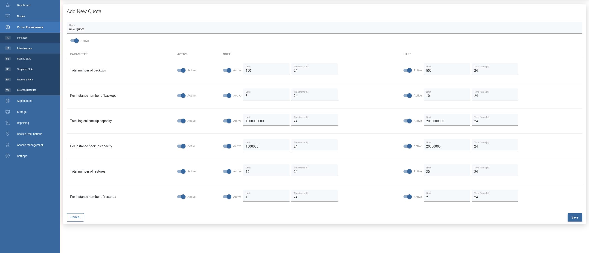
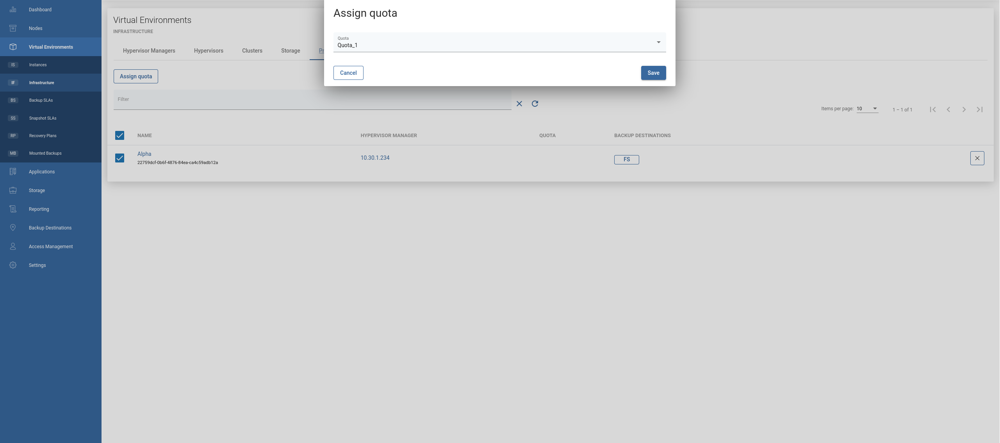

# Quotas

Quotas manage the number of VM backups and restores in projects. Quotas uses user-defined rules to control the number of backups.
Each Rule has two thresholds: **SOFT** and **HARD**. **SOFT** limits only warn you when a certain limit is exceeded.
**HARD** limits prevent the execution of tasks that have exceeded the specified limits. When any of the rules are exceeded, the task fails or warnings are placed on the VM and on backup or restore.
For each limit type you need to specify time frame in which rule will be applied. Quotas can be activated or deactivated at any moment, additionally each rule can be activated or deactivated.
 
To create new Quota, please open Infrastructure tab under Virtual Environments section and go to Quotas then click on Create button on the right.

Quotas are assigned to Projects in the Projects tab or in the detailed Project view.

