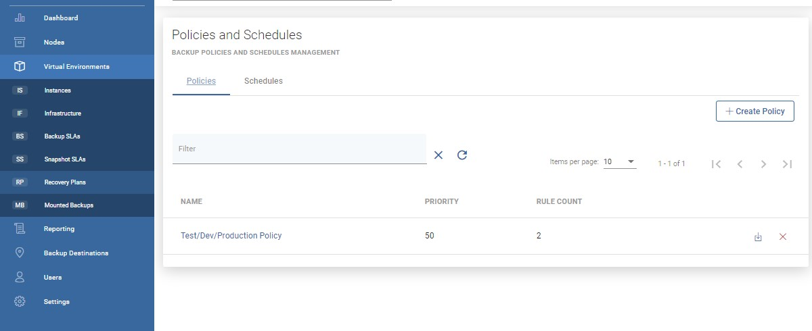
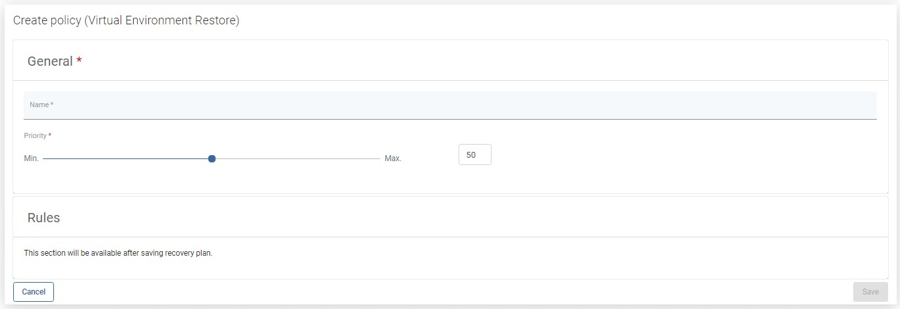
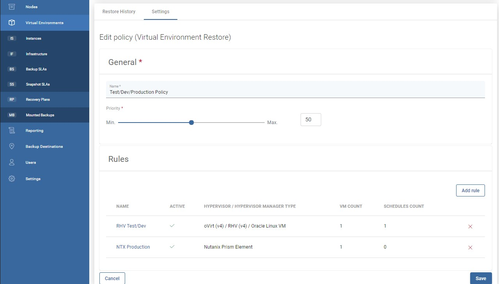
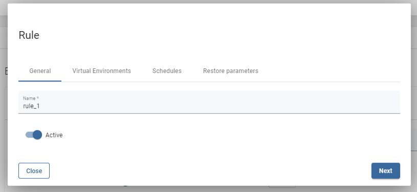
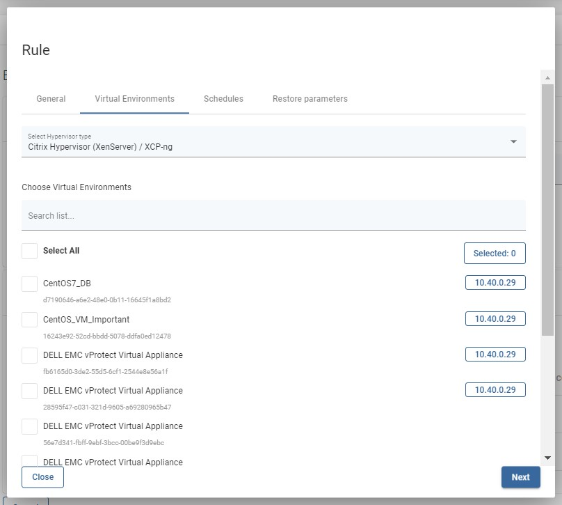
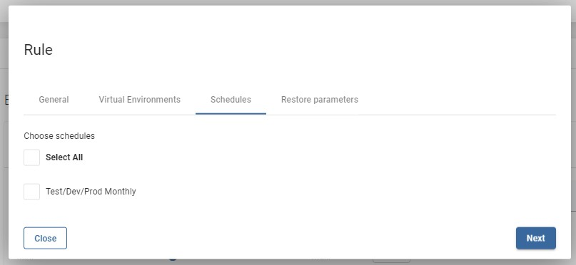
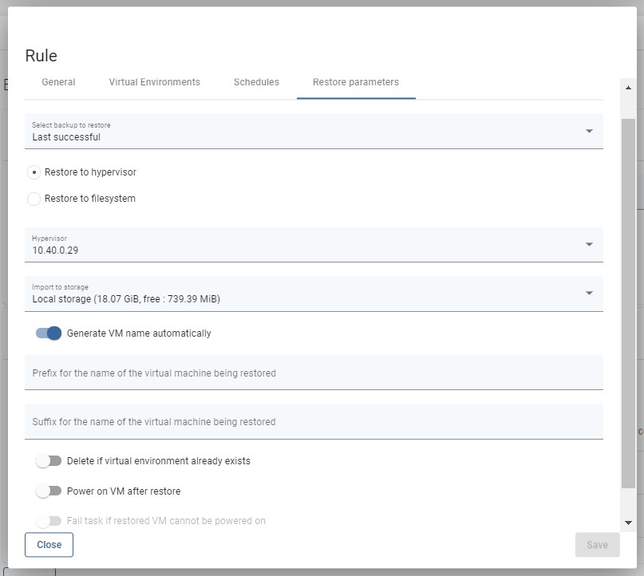

# Policies

To schedule a VM restore using a recovery plan \(or execute a recovery plan manually\), you must first create a policy.

Go to the Recovery Plans from the left menu under the Virtual Environments section.

After clicking on  provide the name of the policy and set priority. After saving you will be able to add rules using the new button on the right.

Click on it and customize restore settings.

Each rule requires a **name** for easier identification later

In the **Virtual Environments** tab, you need to select **Hypervisor type** for this rule and corresponding **virtual environments** of this type

If you previously defined any schedules for recovery plans you can select them in the **Schedules** tab

In **Restore Parameters** tab you specify where VMs are going to be restored - compared to regular restore parameters provided in the manual restore window, notice that:

* you need to choose **\*\*which backup to restore -** last \(regardless of status\) **or** last successful
* you may want to use **Delete if Virtual Environment already exists** - which allows vProtect to remove VM with the same name as the one being restored

