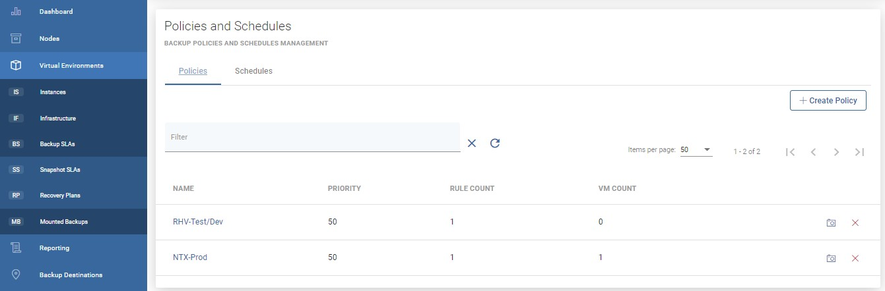
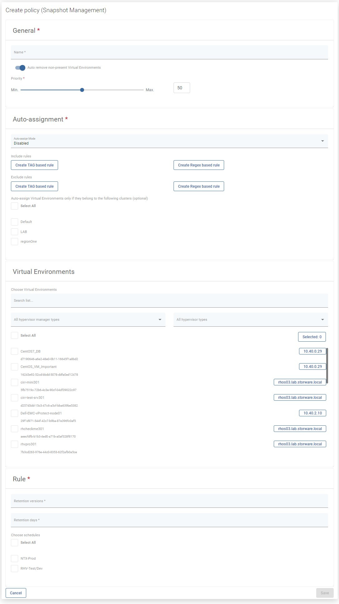

# Policies

In order to enable snapshot management for VM you need to do the following steps:

Go to Snapshot SLAs under the Virtual Environment section and create a new Snapshot Management policy 

As well as other types of Policies, you'll also find 4 main sections here.

## General

Under this section you can set up:

* Name of policy
* Switch on/off for auto remove non-present virtual environments
* Set priority for tasks

## Auto-assignment

In this section you can set up:

* Mode
  * Disabled
  * Assign only
  * Assign and remove
* Include or exclude rules based on hypervisor tag's or regular expression matching VM name, i.e.:
  * regular expression examples:
    * `.*` match any character any number of times
    * `vm-[0-9][0-9][0-9]` - match name that starts with `vm-` and 3 digits
    * `(prod|uat|dev)-[0-9][0-9][0-9][a-z]?` - match name that starts with `prod` or `uat` or `dev` prefix, then `-`, then 3 digits and optional lower-case letter \(matching is case-sensitive\)
  * exclude rules always take precedence over include rules
  * VMs may not be reassigned to the different policy if they already have a matching policy assigned
  * VMs may be reassigned to the different policy only if the mode is `Assign and remove`, current policy assignment rules don't match, and other's policy rules match
  * rules are joined with OR operator, so 
    * if **any** rule \(tag or matched regular expression\) excludes VM - it will be excluded
    * if **no** rule \(tag or matched regular expression\) excludes VM, and **any** rule \(tag or matched regular expression\) includes VM - it will be included
* You can also select clusters to match only VMs that belong to them

## Virtual Environments

In this place, you can select virtual machines manually in a simple way.

## Rule

Provide retention settings - how many snapshots \(created by this policy\) will be kept and for how long. If you have already created a schedule, you can also select it.

### You can also perform the same action thanks to the CLI interface: [CLI Reference]()

