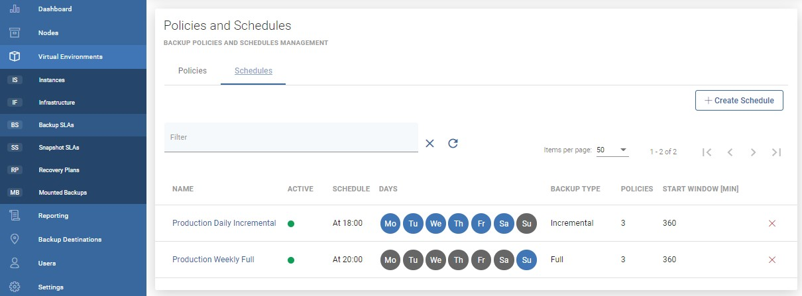
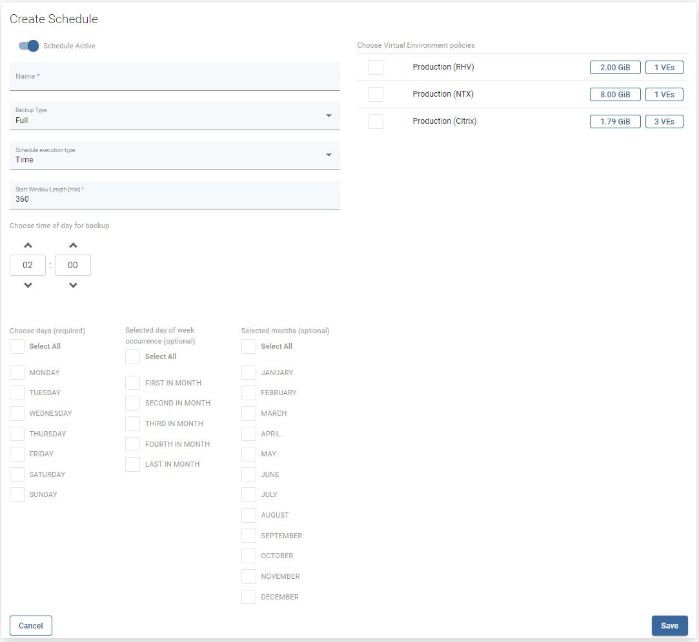

# Schedules

Schedules allow you to invoke specific policies periodically. This allows you to backup multiple VMs automatically.

Schedule defines when and on which days VMs should be backed up. To define a new schedule open Backup SLAs under the Virtual Environments section and go to the Schedules tab, then use the  button.

Now provide properties:

* `Schedule Active` - enable or disable executing schedule
* `Name` - schedule name
* `Backup Type` - defines backup type full, or incremental
* `Execution Type` - choose time or interval mode
* `Start Window` - defines for how long since task start time scheduled tasks are allowed to be executed
* `Choose time of day` - for time execution mode defines when the task should be added to the queue
* `Choose time of interval start` - for interval execution mode defines when tasks should start
* `Choose time of interval end` - for interval execution mode defines when tasks should end
* `Frequency` - defines how often the task will be executed during the interval
* `Choose days` - last required parameter, select days of the week on which the task will be performed

You can also use optional parameters to further personalize the backup time or select a virtual environment policy if it has been previously created.

## You can also perform the same action thanks to the CLI interface: [CLI Reference](untitled-1.md)

