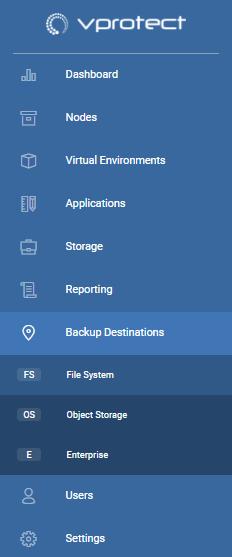
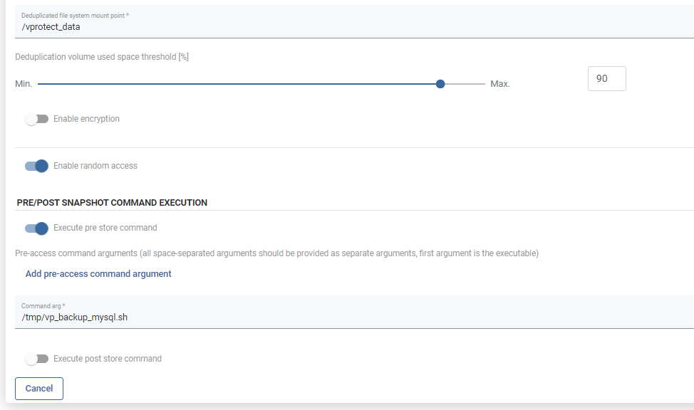

# Backup Destinations

A backup destination is a storage location where vProtect keeps VMs, Containers, Cloud and applications backup copies. To configure a backup destination, you can use the following storage types:

* [Filesystem](filesystem/)
  * [Regular filesystem](filesystem/regular-filesystem.md)
  * [Virtual Data Optimizer \(VDO\)](filesystem/virtual-data-optimizer-vdo.md)
* [Deduplication Appliances](deduplication-appliances/)
  * [Dell EMC Data Domain](deduplication-appliances/dell-emc-data-domain.md)
  * [HPE StoreOnce](deduplication-appliances/hpe-storeonce.md)
  * [Exagrid](deduplication-appliances/exagrid.md)
  * [Neverfail HybriStor](deduplication-appliances/neverfail-hybristor.md)
  * [Catalogic Software vStor](deduplication-appliances/catalogic-software-vstor.md)
* [Object Storage](object-storage/)
  * [AWS S3](object-storage/aws-s3-or-s3-compatible.md)
  * [Google Cloud Storage](object-storage/google-cloud-storage.md)
  * [Microsoft Azure Blob Storage](object-storage/microsoft-azure-blob-storage.md)
  * [OpenStack SWIFT](object-storage/openstack-swift.md)
  * [IBM Cloud Object Storage](object-storage/ibm-cloud-object-storage.md)
  * [Oracle Cloud Infrastructure Object Storage](object-storage/oracle-cloud-infrastructure-object-storage.md)
  * [Scality RING](object-storage/scality-ring.md)
  * [Ceph Rados Gateway](object-storage/ceph-rados-gateway.md)
* [Enterprise Backup Providers](enterprise-backup-providers/)
  * [Dell EMC Avamar](enterprise-backup-providers/dell-emc-avamar.md)
  * [Dell EMC Networker](enterprise-backup-providers/dell-emc-networker.md)
  * [IBM Spectrum Protect](enterprise-backup-providers/ibm-spectrum-protect.md)
  * [Veritas Netbackup](enterprise-backup-providers/veritas-netbackup.md)

Backup destination is a definition of the backup provider configuration and retention settings. Each policy can be backed up to the selected backup destination. Backup destinations must be assigned to the nodes in the node configuration.

**Note:** removal of any backup destination leaves data in the backup provider without option to re-attach it in the future.

## Retention

vProtect handles retention for all backup destinations except NetBackup. There are 4 properties that define how long backup should be kept in the backup destination:

* `Retention (Full) - no. of versions to keep` - number of full backups
* `Retention (Inc.) - no. of versions to keep` - number of incremental backups
* `Retention (Full) - no. of days to keep` - number of days to keep a full backup
* `Retention (Inc.) - no. of days to keep` - number of days to keep an incremental backup

Whichever condition is met first \(either number of versions has been reached or the backup is older than the given limit\), it is removed from the backup destination.

Each backup destination needs also a unique `Name` for easier identification in the configuration.

## Pre/post access command execution

* Prepare your scripts
  * prescript is being invoked before every access to the Backup Destination - common usage - create and mount the remote volume
  * postscript is executed after Node finishes store, restore, clean up operations
* The following environment variables are being set before each execution - you can use them later in your scripts:
  * `VP_VM_GUID` - GUID of the VM in vProtect
  * `VP_VM_UUID` - UUID of the VM used by hypervisor or hypervisor manager
  * `VP_VM_NAME` - name of the VM
  * `VP_VM_TMP_DIR` - path to the folder containing files on staging
  * `VP_BD_GUID` - GUID of the Backup Destination being accessed
  * `VP_BD_NAME` - name of the Backup Destination being accessed
  * `VP_CONTAINER_NAME` - standard container name generated by the vProtect that can be used for names of the volumes \(format `<VM-NAME>__<PART-OF-UUID>`, i.e. `Centos 7__8d3ef6f1`, may contain special characters
  * `VP_EXPORT_PATH` - an export path from Node Configuration, can be used as the mount root for backup destination volumes
  * `VP_TASK_TYPE` - name of the task type, e.g.: `STORE`/`RESTORE`/`DELETE_VM`/`OLD_BACKUPS_REMOVAL` - to distinguish operation type when scripts are being invoked
* Upload your scripts to the **node**, where `vprotect` user is able to access them
* Optionally, you may need to add a new file in `/etc/sudoers.d/` directory to enable `vprotect` user execute privileged script \(like chown operations in some file system locations\): `%vprotect ALL=(root) NOPASSWD: /opt/vprotect/scripts/myscripts/privileged.sh`
* Open the "BACKUP DESTINATIONS" section from the left menu:

* Open your Backup Destination \(click on its name\)
* Provide pre/post access command arguments \(the first argument is the command being executed locally on the **node**\):

