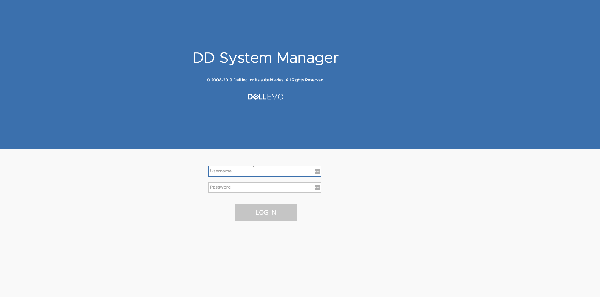
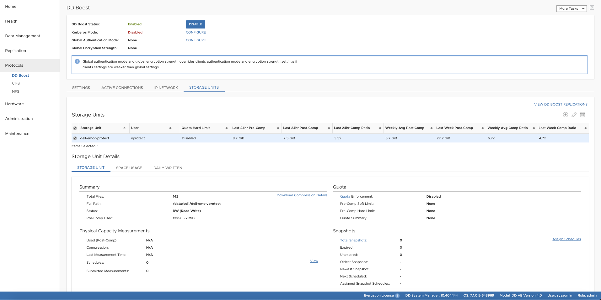

# Dell EMC Data Domain

## Create a new Backup Destination \(Dell EMC Data Domain\)

* Go into a backup destination menu and click create a backup destination
* Provide a name and description for a new backup destination
* Specify retention days for full and incremental backups
* Specify retention versions for full and incremental backups
* Choose and assign node configuration, to which you want to attach a new backup destination
* Add to one or more storage paths
  * `example - /vprotect_data/backupdestination` 
* Save configuration 

## DD Boost FS Plugin

**Note:**

* to boost the backup process we recommend to use **single** Storage Unit and mtree and use subfolders on the BoostFS for multiple backup destinations \(with possibly different retention settings\)
  * no additional data copy is needed in store phase, when staging is using the same file system as the backup destination
  * setup assumes a single Storage Unit and a single mtree for all backup destinations
  * staging space should always be a top directory, and all backup destinations should be defined as separate subfolders of this file system
  * vProtect handles retention and each backup destination may have different retention configured
  * single Storage Unit also will affect replication as it has to cover all backup destinations, and may replicate temporary data from staging space or mounted backups
* **sharing** the same BoostFS across multiple nodes allows administrator to create backups on one node \(i.e. one host/environment\) and restore using a different node \(to the different host/environment\)
  * UID/GID ownership and permissions must allow vProtect to read/write contents of the BoostFS share
  * To meet these requirements, a user and group named vprotect, that was created during the installation process must have the same UID and GID on each vProtect node machine. You can create it before installing vProtect packages or change it after installation 

Prepare your PowerProtect DD as a backup destination:

* Login to PowerProtect DD and create NFS Storage Unit called `storware-vprotect`





* Download BoostFS RPM from Dell EMC site
* Install BoostFS:

  ```text
  rpm -ivh DDBoostFS-7.0.0.0-633922.rhel.x86_64.rpm
  ```

* Save password for BoostFS

  ```text
  # Syntax
  /opt/emc/boostfs/bin/boostfs lockbox set -d [DataDomain_IP_OR_DNS_NAME] -u [Access_User_Name] -s [Storage_Area_Name]
  # Example
  /opt/emc/boostfs/bin/boostfs lockbox set -d 10.1.10.100 -u vprotect -s vprotectbackup
  ```

* Add /etc/fstab entry:

  ```text
  # Syntax
  [DataDomain_IP_OR_DNS_NAME]:/[Storage_Area_Name] /[Mount_Point] boostfs defaults,_netdev,bfsopt(allow-others=true) 0 0
  # Example
  10.1.10.100:/vprotectbackup /vprotect_data boostfs defaults,_netdev,bfsopt(allow-others=true) 0 0
  ```

* Mount fstab entry

  ```text
  mount -a
  ```

* For manual, one-time mount you can run this command

  ```text
  # Syntax
  /opt/emc/boostfs/bin/boostfs mount -o allow-others=true -d [DataDomain_IP_OR_DNS_NAME] -s [Storage_Area_Name] /[Mount_Point]
  # Example
  /opt/emc/boostfs/bin/boostfs mount -o allow-others=true -d 10.1.10.100 -s vprotectbackup /vprotect_data
  ```

* Confirm with `df -h` that your `/vprotect_data` is mounted  
**Note:**
Remember to specify the backup destination path to be a subdirectory of /vprotect_data if you would like to use the same storage unit as a staging space and backup destination - for example: /vprotect_data/my-backups

  ```text
  mkdir /vprotect_data/my-backups
  ```

* Set ownership to vprotect user on directory /vprotect_data

  ```text
  chown vprotect:vprotect -R /vprotect_data
  ```


