# Exagrid

## Overview

vProtect support integration with Exagrid. You can create two types of shares \(NFS and CIFS\), but in this case, we recommend using the CIFS share as the backup destination.

### Examples

To create network share login to Exagrid dashboard and go to Manage -&gt; Shares

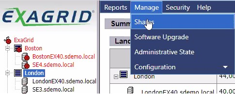

Then create a new share. From here, you can create an NFS or CIFS share, depending on the protocol you choose

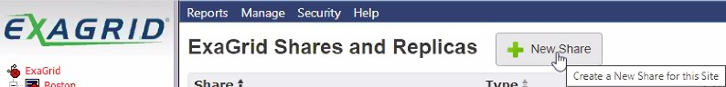

### NFS

As we said before, we do not recommend this method for storing backups, but we will describe the basic steps for creating an NFS share.

So after clicking "New Share" you'll see this window. Change "Protocol" to NFS, configure the rest according to your requirements.

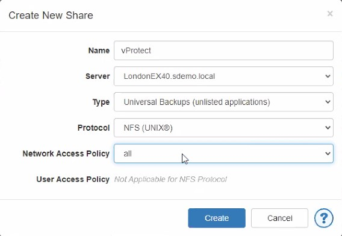

After creation, you will see a summary window with commands that allow you to mount NFS share under the vProtect node machine.

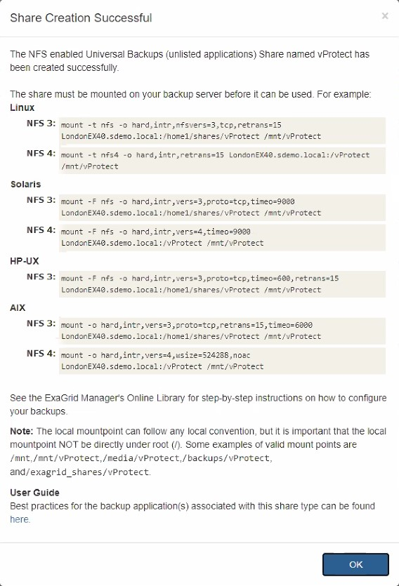

From the menu, you can see that we have a new share

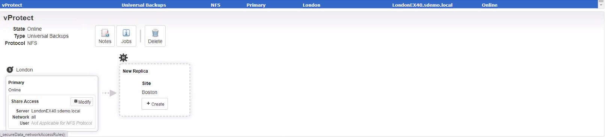

It is good practice to create an NFS share access policy

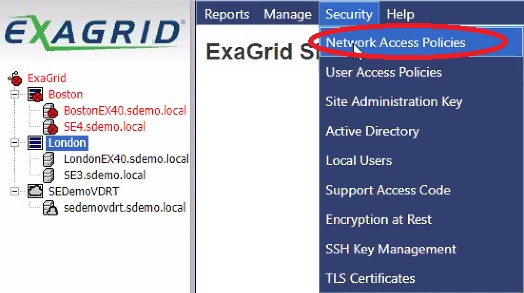

As you can see, you can limit access to a single host or the entire address pool.  
Remember to edit share and select Access Policy

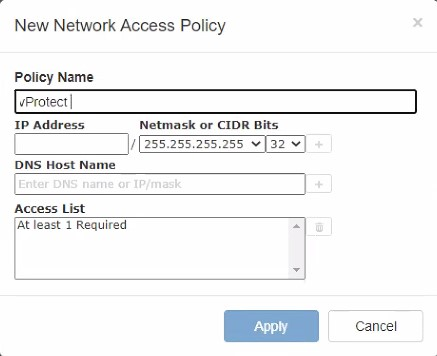

### CIFS

Now is turn for the method we recommended. After clicking "New Share" you'll see this window. Change "Protocol" to CIFS/SMB, configure the rest according to your requirements.

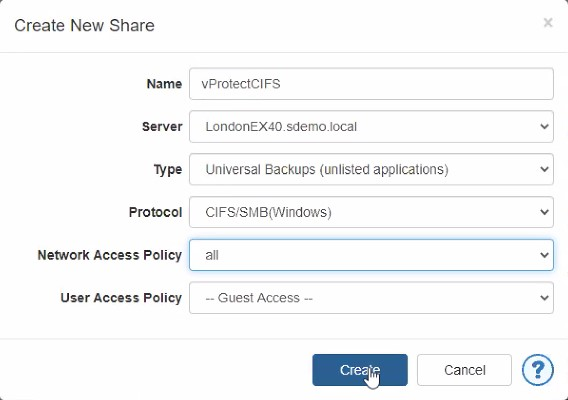

After creation, you will see a summary window with basic information about CIFS share.

From the menu, you can see that we have a new share

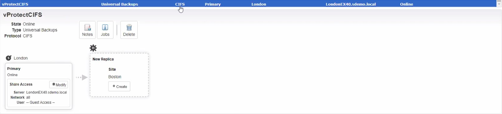

It is good practice to create a CIFS share user access policy

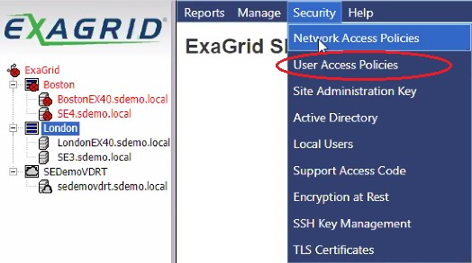

Select a single user or a whole group of users

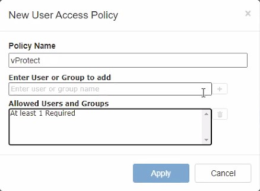

### Mounting Exagrid network shares

To mount NFS share:

* Create NFS directory mount point on vProtect node host machine `mkdir /directorypath`
* Mount NFS Share `mount -t nfs Exagrid_IP:/sharename /mountdirectory`
* Check if you are connected with NFS Share `df -kh`

To permanently add an NFS share, you must edit the /etc/fstab file  
`Exagrid_IP:/sharename /mountdirectory nfs defaults 0 0`

To mount CIFS share:

* Install the required packages `yum install cifs-utils`
* Create a mount point directory `mkdir /directorypath`
* To mount CIFS share `mount.cifs //hostname-or-ip_address/sharename /mnt/testmnt -o ro,guest`
* To permanently add a CIFS share, you must edit /etc/fstab file `//hostname-or-ip_address/sharename /mnt/testmnt cifs ro,guest 0 0`

### Creating Backup Destination

Now we can create a backup destination for our backups.  
Please login to the vProtect dashboard and go to the "Backup Destination" tab from the left side menu.  
Then choose the "File system" from the list of backup destinations you can create.

You only need to enter the unique name of the backup destination and mount point as the storage path.

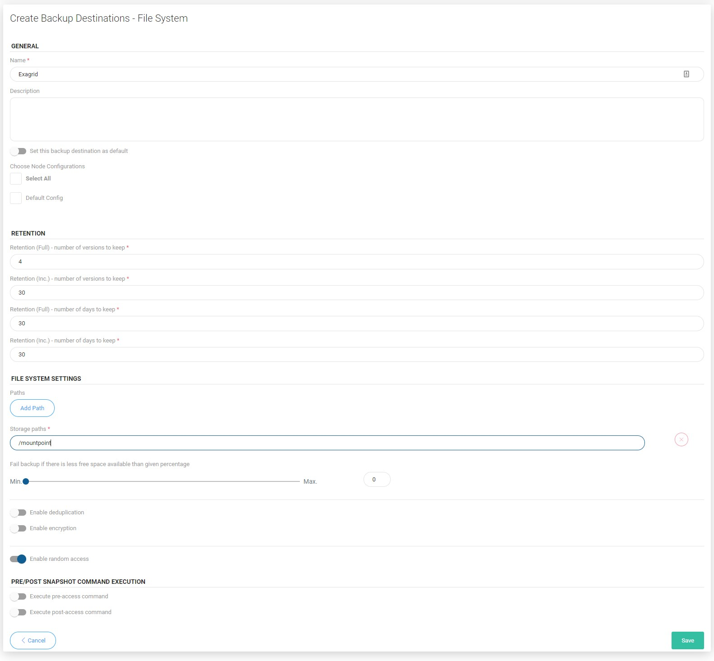

