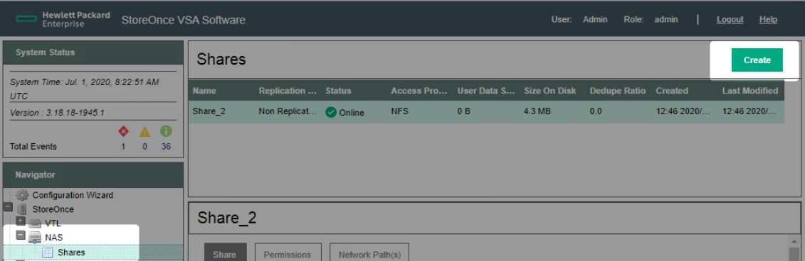
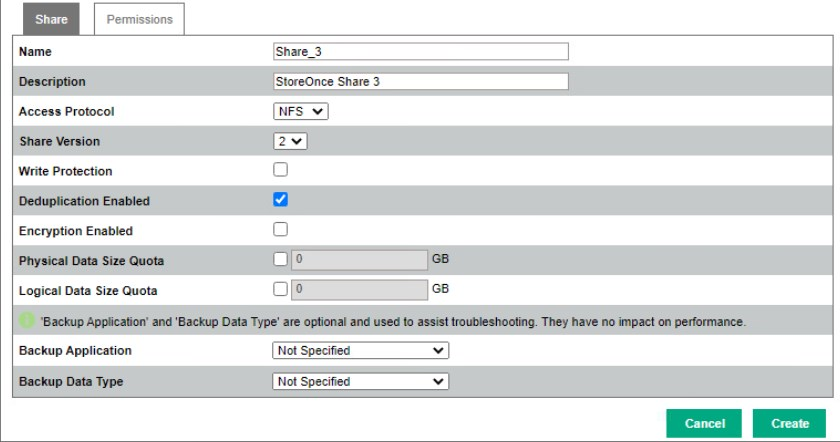
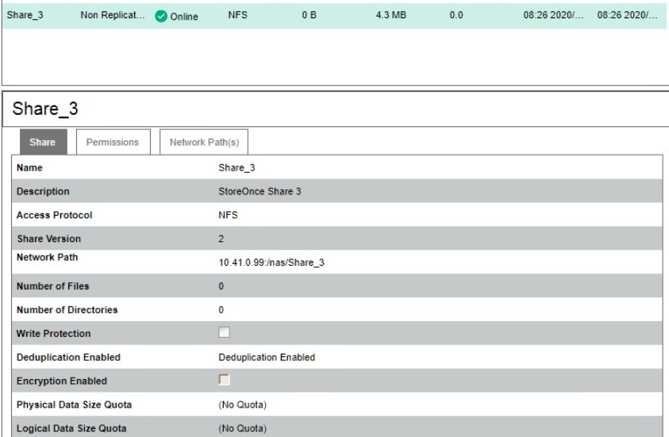
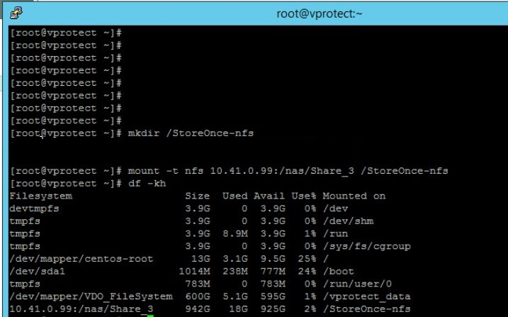
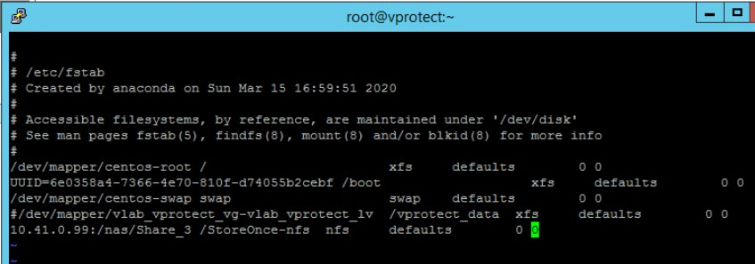

# HPE StoreOnce

## Overview

HPE StoreOnce is another product that allows you to store backups from our vProtect application. As with other providers, we can use NFS share here.

### Example

To create NFS share from StoreOnce dashboard, after login go to StoreOnce -&gt; NAS -&gt; Shares on the left side tree menu. Next click on the "Create" button on the top right.

Only one change is required, the rest is optional and depends on your preferences.  
This is the "access protocol", you must select the NFS option.

After creating, you'll see a summary window. \(remember "Network Path"\)

Now connect to the vProtect node host:

* Create NFS directory mount point

  `mkdir /directorypath`

* Mount NFS Share

  `mount -t nfs Storeonce_IP:/nas/sharename /mountdirectory`

* Check if you are connected with NFS Share

  `df -kh`

To permanently add an NFS share, you must edit the / etc / fstab file  
`Storeonce_IP:/nas/sharename /mountdirectory nfs defaults 0 0`

Now we can create a backup destination for our backups.  
Please login to the vProtect dashboard and go to the "Backup Destination" tab from the left side menu.  
Then choose the "File system" from the list of backup destinations you can create.

You only need to enter the unique name of the backup destination and mount point as the storage path.

