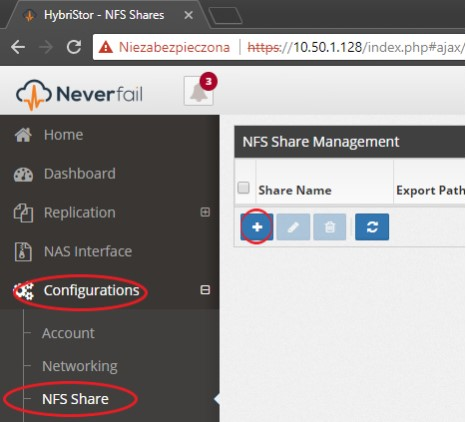
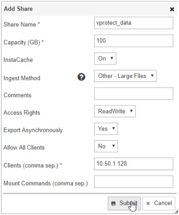

# Neverfail HybriStor

vProtect support integration with Neverfail HybriStor. You can use HybriStor volumes as any other file system \(mount single volume over NFS\).

Login to HybriStore dashboard and create NFS share:



In "Clients" enter your vProtect node IP address and choose "No" for "allow all clients" option:



Now login to vProtect node host and mount NFS share:

```text
# To create mountpoint:
mkdir /vprotect_data/backups

# To be sure of correctly set credentials:
chown -R vprotect:vprotect /vprotect_data

# For temporary mount:
mount -t nfs -o sync HybriStor_IP:/vprotect_data /vprotect_data/backups

# For persistent mount edit /etc/fstab file:
#   <file system>               <dir>             <type> <options> <dump> <pass>
HybriStor_IP:/vprotect_data /vprotect_data/backups  nfs   defaults    0     0

# To mount NFS from fstab:
mount -a
```

Now go to the dashboard and create new File System Backup Destination


