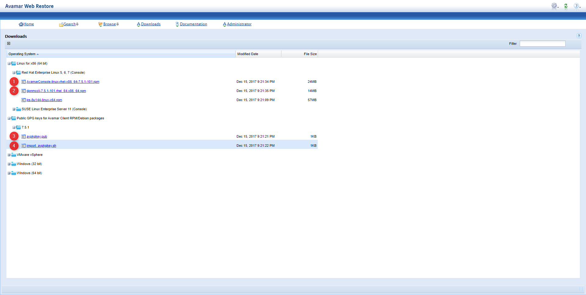
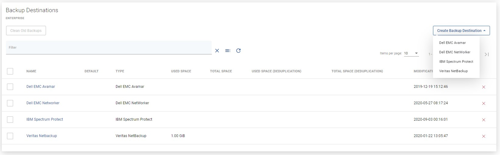
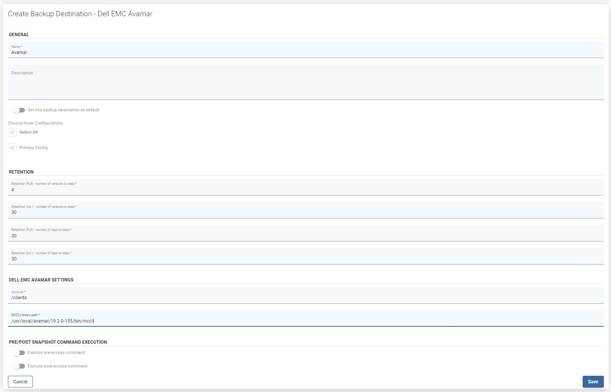

# Dell EMC Avamar

To integrate vProtect with Dell EMC Avamar go ahead and complete following on **vProtect Node**:

1. Download the required software:
   * **mccli**
   * \*\*Avamar Linux Client \*\*
   * **Pubkey** \(\*.pub + sh\)

You can obtain the above by browsing the downloads section of your Avamar server installation, provided you have installed 'UpgradeClientDownloads" from EMC repository to the Avamar server. When in doubt, consult Avamar documentation




1. Import GPG key by invoking script:

```text
sh import_avpkgkey.sh
```

1. Run avregister, fill in the required info

```text
# /usr/local/avamar/bin/avregister

=== Client Registration and Activation
This script will register and activate the client with the Administrator server.

Enter the Administrator server address (DNS text name or numeric IP address, DNS name preferred): <your_Avamar_server_address>

Enter the Avamar server domain [clients]:
avagent.d Info: Stopping Avamar Client Agent (avagent)...
avagent.d Info: Client Agent stopped.                      [  OK  ]
avagent Info <5008>: Logging to /usr/local/avamar/var/avagent.log
avagent.d Info: Client activated successfully.             [  OK  ]
avagent.d Info: Client Agent service started in systemd    [  OK  ]
avagent Info <5008>: Logging to /usr/local/avamar/var/avagent.log
avagent Info <5417>: daemonized as process id 17479
avagent.d Info: Client Agent started.                      [  OK  ]
avagent.d Info: Stopping Avamar Client Agent (avagent)...
avagent.d Info: Client Agent stopped.                      [  OK  ]
Registration Complete.
```

1. Install _**Management Console Command Line Interface**_ \(mccli\)

```text
# rpm -Uvh --force dpnmccli-19.2.0-155.rhel_64.x86_64.rpm
Preparing...                          ################################# [100%]
Updating / installing...
  1:dpnmccli-19.2.0-155              ################################# [100%
```

**Note:** please change RPM name to match the file downloaded from you Avamar installation

1. Run _**avsetup\_mccli**_ to configure management console

You need to point mccli to your JRE installation, fill in connection details, plus provide admin username and password

```text
# /usr/local/avamar/19.2.0-155/bin/avsetup_mccli
setting linux default
ls: cannot access /usr/java/latest: No such file or directory
Enter the location of your JRE (1.8) installation []: /usr/lib/jvm/java-1.8.0-openjdk-1.8.0.242.b08-0.el7_7.x86_64/jre
Enter the root directory of your Avamar installation [/usr/local/avamar/19.2.0-155]:
Enter the user data directory of your Avamar installation [~/.avamardata/19.2.0-155/var]:

Configuring default local mcsprofile in /usr/local/avamar/19.2.0-155/lib/mcclimcs.xml

Enter default mcs host name (mcsaddr) [localhost]: 
Enter default mcs port number on localhost (mcsport) [7778]:
Enter default userid on localhost (mcsuserid) [MCUser]: root
Enter password for root (mcspasswd): adminuserpass

       Avamar CLI 19.2.0 has been configured correctly
       Type mccli command to use it
```

Quickly test the correctness of this config by typing in:

```text
# /usr/local/avamar/19.2.0-155/bin/mccli activity show
```

If the output shows the latest activity on Avamar, everything seems to be ok.

In the other case check your config and/or Avamar documentation,

1. Install **avtar** - [https://www.dellemc.com/en-us/collaterals/unauth/technical-guides-support-information/products/data-protection/docu91839.pdf](https://www.dellemc.com/en-us/collaterals/unauth/technical-guides-support-information/products/data-protection/docu91839.pdf) - page 16
2. Use `avregister` command to register backup client
3. Install **mccli** - [https://www.dellemc.com/en-us/collaterals/unauth/quick-reference-guides/products/data-protection/docu91838.pdf](https://www.dellemc.com/en-us/collaterals/unauth/quick-reference-guides/products/data-protection/docu91838.pdf) - page 18
4. Use `avsetup_mccli` to setup client
   * **When choosing JRE - do NOT use** `/usr/java/latest` but `/usr/java/jre1.8...`
5. Proceed with configuration and add a _**backup destination**_

On the left side menu click _**Backup Destinations**_ then change to _**enterprise**_ sub-tab, click the _**Create Backup Destination**_ button and choose



Fill in the required info. itt may look similar to the example below:



