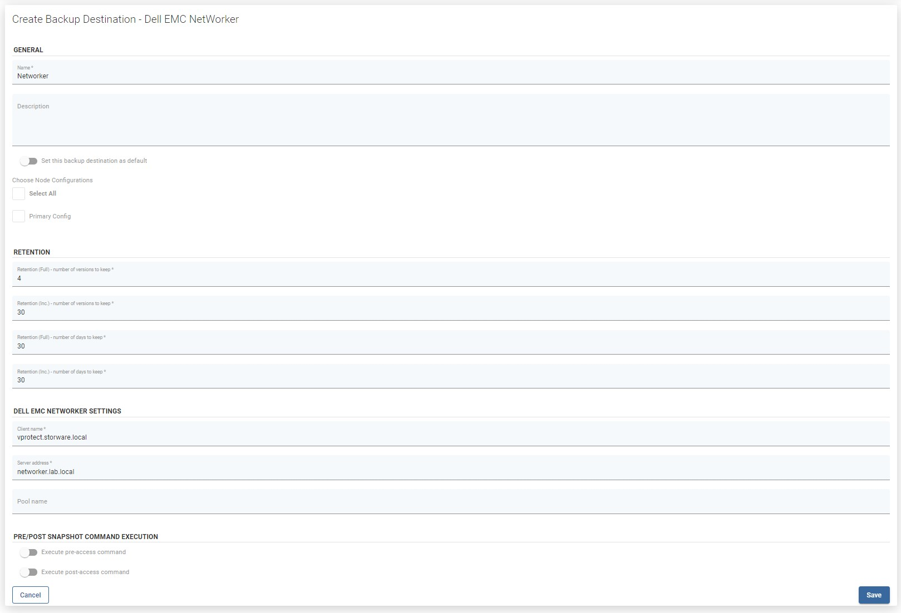

# Dell EMC Networker

1. To enable Dell-EMC Networker support, please install NetWorker Client as follows:

   ```text
   yum install lgtoxtdclnt-9.1.0.2-1.x86_64.rpm lgtoclnt-9.1.0.2-1.x86_64.rpm
   ```

2. Register the client on the Networker server. More information about installation and configuration of the Networker client can be found in the [Networker documentation](https://www.dellemc.com/fr-mg/collaterals/unauth/technical-guides-support-information/products/storage-5/docu81532.pdf).
3. Log in to vProtect and go to "Backup Destinations". Click on "Create Backup Destination" and choose "Dell EMC NetWorker". Type the name for the new backup destination and set the retention. Enter the Networker client name and the Server address.



**Note:** Add the vProtect user to the group "Application Administrators" to enable vProtect to delete backups from the Networker server.

