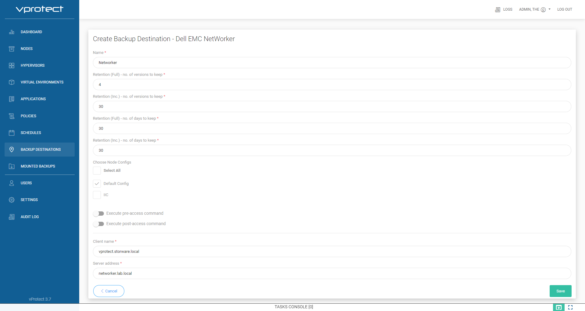

# Dell EMC Networker

1. To enable Dell-EMC Networker support please install NetWorker Client as follows:

   ```text
   yum install lgtoxtdclnt-9.1.0.2-1.x86_64.rpm lgtoclnt-9.1.0.2-1.x86_64.rpm
   ```

2. Register client on Networker server. More information about installation, configuration Networker client in documentation [Networker documentation](https://www.dellemc.com/fr-mg/collaterals/unauth/technical-guides-support-information/products/storage-5/docu81532.pdf)
3. Login to vProtect, and go to "Backup Destinations". Click on "Create Backup Destination", chose "Dell EMC NetWorker". Type name for a new backup destination, and set retention. Enter Networker client name, and Server address.



**Note:** Add vProtect user to group "Application Administrators" to enable delete backups by vProtect from Networker server.

